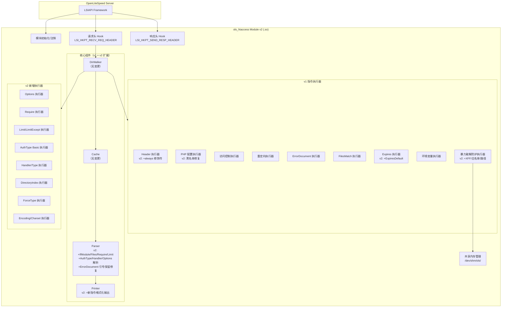
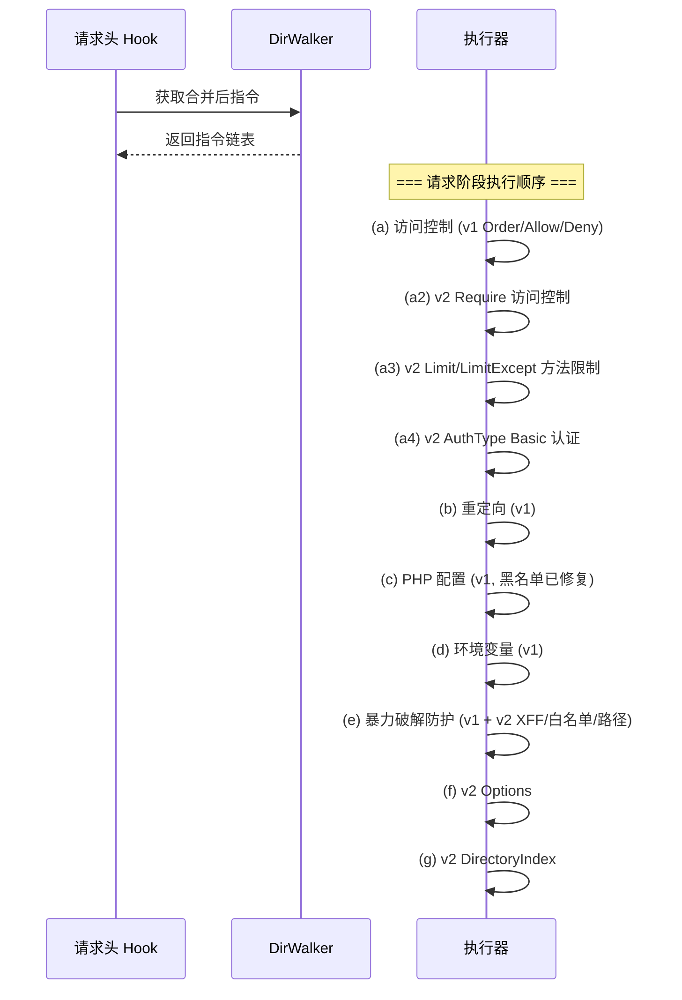

# 设计文档：OLS .htaccess 模块 v2 增强

## 概述

本文档描述 OLS .htaccess 模块 v2 增强版的技术设计。v2 基于已有的 v1 模块（28 种指令类型、24 条正确性属性），通过以下三个维度进行扩展：

1. **Bug 修复**（P0）：修复 php_value 黑名单误判和 ErrorDocument 文本消息模式不兼容两个已知缺陷
2. **新指令支持**（P1-P4）：新增约 30 种指令类型，覆盖 `<IfModule>`、`Options`、`<Files>`、`Header always`、`ExpiresDefault`、Apache 2.4 `Require`、`<Limit>`/`<LimitExcept>`、AuthType Basic、AddHandler/SetHandler/AddType、DirectoryIndex、ForceType、AddEncoding、AddCharset
3. **暴力破解防护增强**：新增 BruteForceXForwardedFor、BruteForceWhitelist、BruteForceProtectPath 三个配置指令

核心设计约束：
- 所有新增 `directive_type_t` 枚举值必须追加在 `DIR_BRUTE_FORCE_THROTTLE_DURATION` 之后，保持二进制兼容
- v1 已有的 28 种指令类型行为不变，所有 v1 测试必须继续通过
- 新增指令遵循 v1 的架构模式：Parser → Printer → Cache → DirWalker → Executor
- 容器指令（IfModule、Files、RequireAny、RequireAll、Limit、LimitExcept）使用与 FilesMatch 相同的 children 链表模式

### 不在范围内

- 面板集成（cPanel/Plesk UI）
- 多租户隔离
- TLS/AutoSSL
- ModSecurity WAF
- 多 PHP 版本动态切换执行层
- RewriteEngine/RewriteRule/RewriteCond（OLS 原生支持）

## 架构

### 整体架构（v2 扩展）

v2 在 v1 架构基础上扩展，不改变核心数据流。新增组件以虚线框标注：



### Hook 阶段划分（v2 扩展）

| Hook 阶段 | v1 指令 | v2 新增指令 |
|---|---|---|
| `LSI_HKPT_RECV_REQ_HEADER` | Order/Allow/Deny、Redirect/RedirectMatch、php_value/php_flag、SetEnv/SetEnvIf/BrowserMatch、BruteForce* | Options、Require/RequireAny/RequireAll、Limit/LimitExcept、AuthType Basic 全家桶、DirectoryIndex、BruteForceXForwardedFor/Whitelist/ProtectPath |
| `LSI_HKPT_SEND_RESP_HEADER` | Header/RequestHeader、Expires、ErrorDocument、FilesMatch | Header always *、ExpiresDefault、Files 块、AddHandler/SetHandler/AddType、ForceType、AddEncoding/AddCharset |

### 请求处理流程（v2 扩展）

v2 在 `on_recv_req_header` 中新增以下执行步骤（在现有步骤之间插入）：




## 组件与接口

### 1. Bug 修复

#### Bug 1：php_value 黑名单修复 (`htaccess_exec_php.c`)

**问题**：`php_ini_system_settings[]` 数组中错误地包含了 5 个 PHP_INI_PERDIR 级别的设置项：`memory_limit`、`max_input_time`、`post_max_size`、`upload_max_filesize`、`safe_mode`。这导致 WordPress、Magento、Nextcloud 等 CMS 通过 .htaccess 设置这些值时被错误拒绝。

**修复方案**：从 `php_ini_system_settings[]` 数组中移除这 5 个条目。修复后的数组仅保留真正的 PHP_INI_SYSTEM 级别设置：

```c
static const char *php_ini_system_settings[] = {
    "allow_url_fopen",
    "allow_url_include",
    "disable_classes",
    "disable_functions",
    "engine",
    "expose_php",
    "open_basedir",
    "realpath_cache_size",
    "realpath_cache_ttl",
    "upload_tmp_dir",
    "max_file_uploads",
    "sys_temp_dir",
    NULL
};
```

**影响范围**：仅修改 `htaccess_exec_php.c` 中的静态数组，不影响函数签名或其他组件。

#### Bug 2：ErrorDocument 文本消息引号修复

**问题**：`htaccess_parser.c` 中的 `rest_of_line()` 函数在遇到引号包裹的字符串时会剥离引号（`"Custom message"` → `Custom message`），但 `htaccess_exec_error_doc.c` 中的 `exec_error_document()` 通过检查 `value[0] == '"'` 来判断文本消息模式。解析器剥离了执行器需要的引号，导致文本消息模式永远无法触发。

**修复方案**：修改 `rest_of_line()` 函数，对 ErrorDocument 指令的值部分保留引号。具体实现为在 `htaccess_parser.c` 中引入一个 `rest_of_line_raw()` 变体，不剥离引号，仅在解析 ErrorDocument 值时使用：

```c
/**
 * Get the rest of the line (trimmed) as a strdup'd string, preserving quotes.
 * Used for ErrorDocument values where the leading quote is semantically significant.
 */
static char *rest_of_line_raw(const char **pp)
{
    const char *p = skip_ws(*pp);
    if (!*p)
        return NULL;
    size_t len = strlen(p);
    len = trimmed_len(p, len);
    if (len == 0)
        return NULL;
    char *s = strndup(p, len);
    *pp = p + len;
    return s;
}
```

**Printer 对应修改**：`print_directive()` 中 `DIR_ERROR_DOCUMENT` 分支需要正确输出引号包裹的文本消息值（当 `value[0] == '"'` 时直接输出，不额外加引号）。

### 2. Parser 扩展 (`htaccess_parser.c`)

Parser 需要新增以下解析能力：

#### 2.1 容器块解析

新增 4 种容器块的开闭标签识别函数（与现有 `is_files_match_open/close` 模式一致）：

```c
/* IfModule 块 */
static int is_ifmodule_open(const char *line, char **out_module, int *negated);
static int is_ifmodule_close(const char *line);

/* Files 块 */
static int is_files_open(const char *line, char **out_filename);
static int is_files_close(const char *line);

/* RequireAny / RequireAll 块 */
static int is_require_any_open(const char *line);
static int is_require_any_close(const char *line);
static int is_require_all_open(const char *line);
static int is_require_all_close(const char *line);

/* Limit / LimitExcept 块 */
static int is_limit_open(const char *line, char **out_methods);
static int is_limit_close(const char *line);
static int is_limit_except_open(const char *line, char **out_methods);
static int is_limit_except_close(const char *line);
```

#### 2.2 IfModule 特殊处理

IfModule 的解析逻辑与其他容器块不同：
- **正向条件**（`<IfModule mod_xxx.c>`）：OLS 环境下假定模块已加载，解析并包含所有内部指令（展平到父级链表）
- **否定条件**（`<IfModule !mod_xxx.c>`）：跳过所有内部指令直到 `</IfModule>`
- **嵌套**：支持多层嵌套，使用深度计数器追踪

设计决策：IfModule 在解析阶段即决定是否包含内部指令，不生成容器 Directive 节点。这简化了执行器逻辑，因为 OLS 环境下模块加载状态在解析时已知。但 Printer 需要能重建 IfModule 块结构以保持 round-trip 属性，因此仍需生成 `DIR_IFMODULE` 容器节点。

**最终方案**：生成 `DIR_IFMODULE` 容器节点，`name` 字段存储模块名（含可能的 `!` 前缀），`children` 存储内部指令。执行器在遍历时根据条件决定是否执行 children。

#### 2.3 简单指令解析

以下指令使用 `match_kw()` + `next_token()` / `rest_of_line()` 的标准模式解析：

| 指令 | 解析方式 | name 字段 | value 字段 |
|---|---|---|---|
| `Options` | `rest_of_line()` 获取所有标志 | `NULL` | `"-Indexes +FollowSymLinks"` |
| `Header always set/unset/...` | 检测 `always` 关键字后按 v1 Header 逻辑 | 头名称 | 头值 |
| `ExpiresDefault` | `rest_of_line()` + `parse_expires_duration()` | `NULL` | 原始字符串 |
| `Require all granted/denied` | `match_kw("Require")` + 子关键字 | `NULL` | `NULL` |
| `Require ip` / `Require not ip` | `rest_of_line()` 获取 IP/CIDR 列表 | `NULL` | IP/CIDR 字符串 |
| `AuthType` | `next_token()` | `NULL` | `"Basic"` |
| `AuthName` | `rest_of_line()` | `NULL` | realm 字符串 |
| `AuthUserFile` | `rest_of_line()` | `NULL` | 文件路径 |
| `Require valid-user` | 关键字匹配 | `NULL` | `NULL` |
| `AddHandler` | `next_token()` + `rest_of_line()` | handler 名 | 扩展名列表 |
| `SetHandler` | `rest_of_line()` | `NULL` | handler 名 |
| `AddType` | `next_token()` + `rest_of_line()` | MIME 类型 | 扩展名列表 |
| `DirectoryIndex` | `rest_of_line()` | `NULL` | 文件名列表 |
| `ForceType` | `next_token()` | `NULL` | MIME 类型 |
| `AddEncoding` | `next_token()` + `rest_of_line()` | 编码类型 | 扩展名列表 |
| `AddCharset` | `next_token()` + `rest_of_line()` | 字符集名 | 扩展名列表 |
| `BruteForceXForwardedFor` | `next_token()` | `NULL` | `"On"/"Off"` |
| `BruteForceWhitelist` | `rest_of_line()` | `NULL` | CIDR 列表 |
| `BruteForceProtectPath` | `next_token()` | `NULL` | URL 路径 |

### 3. Printer 扩展 (`htaccess_printer.c`)

`print_directive()` 的 switch 语句新增所有 v2 指令类型的格式化分支。容器指令（IfModule、Files、RequireAny、RequireAll、Limit、LimitExcept）需要递归打印 children 链表。

### 4. 新增执行器

#### 4.1 Options 执行器 (`htaccess_exec_options.c/h`)

```c
/**
 * 执行 Options 指令。
 * 解析 value 中的标志（+/-Indexes, +/-FollowSymLinks 等），
 * 通过 LSIAPI 设置对应的目录选项。
 */
int exec_options(lsi_session_t *session, const htaccess_directive_t *dir);
```

#### 4.2 Require 执行器 (`htaccess_exec_require.c/h`)

```c
/**
 * 评估 Apache 2.4 Require 访问控制指令。
 * 支持 Require all granted/denied、Require ip、Require not ip。
 * 支持 RequireAny/RequireAll 容器块的逻辑组合。
 *
 * 返回: 0 = 允许, -1 = 拒绝 (设置 403)
 */
int exec_require(lsi_session_t *session,
                 const htaccess_directive_t *directives,
                 const char *client_ip);
```

当 Require 指令与 v1 Order/Allow/Deny 共存时，Require 优先（Apache 2.4 语义），记录 WARN 日志。

#### 4.3 Limit/LimitExcept 执行器 (`htaccess_exec_limit.c/h`)

```c
/**
 * 评估 Limit/LimitExcept 块。
 * 检查请求 HTTP 方法是否在方法列表中，决定是否执行 children。
 *
 * Limit: 方法在列表中 → 执行 children
 * LimitExcept: 方法不在列表中 → 执行 children
 */
int exec_limit(lsi_session_t *session, const htaccess_directive_t *dir,
               const char *http_method);
```

#### 4.4 AuthType Basic 执行器 (`htaccess_exec_auth.c/h`)

```c
/**
 * 执行 HTTP Basic 认证。
 * 从指令链表中收集 AuthType、AuthName、AuthUserFile、Require valid-user，
 * 验证请求中的 Authorization 头。
 *
 * 返回: 0 = 认证通过或不需要认证, -1 = 返回 401
 */
int exec_auth_basic(lsi_session_t *session,
                    const htaccess_directive_t *directives);

/**
 * 解析 htpasswd 文件中的一行，验证密码。
 * 支持 crypt、MD5 ($apr1$)、bcrypt ($2y$) 格式。
 *
 * 返回: 1 = 匹配, 0 = 不匹配, -1 = 错误
 */
int htpasswd_check(const char *hash, const char *password);
```

#### 4.5 Handler/Type 执行器 (`htaccess_exec_handler.c/h`)

```c
/**
 * 执行 AddHandler/SetHandler 指令（DEBUG 级别日志记录）。
 * 执行 AddType 指令（设置 Content-Type 响应头）。
 */
int exec_add_handler(lsi_session_t *session, const htaccess_directive_t *dir);
int exec_set_handler(lsi_session_t *session, const htaccess_directive_t *dir);
int exec_add_type(lsi_session_t *session, const htaccess_directive_t *dir,
                  const char *filename);
```

#### 4.6 DirectoryIndex 执行器 (`htaccess_exec_dirindex.c/h`)

```c
/**
 * 执行 DirectoryIndex 指令。
 * 按顺序检查 value 中的文件名是否存在于请求目录中，
 * 找到第一个存在的文件后通过 LSIAPI 设置内部重定向。
 */
int exec_directory_index(lsi_session_t *session,
                         const htaccess_directive_t *dir,
                         const char *target_dir);
```

#### 4.7 ForceType 执行器 (`htaccess_exec_forcetype.c/h`)

```c
/**
 * 执行 ForceType 指令，设置 Content-Type 响应头。
 */
int exec_force_type(lsi_session_t *session, const htaccess_directive_t *dir);
```

#### 4.8 Encoding/Charset 执行器 (`htaccess_exec_encoding.c/h`)

```c
/**
 * 执行 AddEncoding 指令，设置 Content-Encoding 响应头。
 * 执行 AddCharset 指令，追加 charset 参数到 Content-Type。
 */
int exec_add_encoding(lsi_session_t *session, const htaccess_directive_t *dir,
                      const char *filename);
int exec_add_charset(lsi_session_t *session, const htaccess_directive_t *dir,
                     const char *filename);
```

### 5. 暴力破解防护增强 (`htaccess_exec_brute_force.c`)

在现有 `exec_brute_force()` 函数中扩展：

```c
/* 新增配置扫描 */
for (dir = directives; dir; dir = dir->next) {
    switch (dir->type) {
    /* ... 现有 v1 case ... */
    case DIR_BRUTE_FORCE_X_FORWARDED_FOR:
        use_xff = dir->data.brute_force.enabled;  /* 复用 enabled 字段 */
        break;
    case DIR_BRUTE_FORCE_WHITELIST:
        whitelist_cidrs = dir->value;  /* 逗号分隔的 CIDR 列表 */
        break;
    case DIR_BRUTE_FORCE_PROTECT_PATH:
        /* 追加到保护路径列表 */
        add_protect_path(protect_paths, &num_paths, dir->value);
        break;
    }
}

/* XFF 处理：如果启用，从 X-Forwarded-For 头获取真实 IP */
if (use_xff) {
    const char *xff = lsi_session_get_req_header_by_name(
        session, "X-Forwarded-For", 15, &xff_len);
    if (xff && xff_len > 0)
        client_ip = extract_first_ip(xff, xff_len);  /* 取最左侧 IP */
}

/* 白名单检查 */
if (whitelist_cidrs && is_ip_whitelisted(client_ip, whitelist_cidrs))
    return LSI_OK;  /* 白名单 IP 直接放行 */

/* 路径检查：仅对保护路径生效 */
if (!is_protected_path(uri, protect_paths, num_paths))
    return LSI_OK;
```

### 6. mod_htaccess.c 扩展

`on_recv_req_header()` 新增执行步骤（在现有步骤之间插入）：

```c
/* (a2) Apache 2.4 Require 访问控制 */
rc = exec_require(session, directives, client_ip);
if (rc == LSI_ERROR) { /* 403 */ ... }

/* (a3) Limit/LimitExcept 方法限制 */
for (dir = directives; dir; dir = dir->next) {
    if (dir->type == DIR_LIMIT || dir->type == DIR_LIMIT_EXCEPT)
        exec_limit(session, dir, http_method);
}

/* (a4) AuthType Basic 认证 */
rc = exec_auth_basic(session, directives);
if (rc == LSI_ERROR) { /* 401 */ ... }

/* (f) Options */
for (dir = directives; dir; dir = dir->next) {
    if (dir->type == DIR_OPTIONS)
        exec_options(session, dir);
}

/* (g) DirectoryIndex */
for (dir = directives; dir; dir = dir->next) {
    if (dir->type == DIR_DIRECTORY_INDEX)
        exec_directory_index(session, dir, target_dir);
}
```

`on_send_resp_header()` 新增执行步骤：

```c
/* Header always 指令 — 在所有响应上执行 */
for (dir = directives; dir; dir = dir->next) {
    switch (dir->type) {
    case DIR_HEADER_ALWAYS_SET:
    case DIR_HEADER_ALWAYS_UNSET:
    case DIR_HEADER_ALWAYS_APPEND:
    case DIR_HEADER_ALWAYS_MERGE:
    case DIR_HEADER_ALWAYS_ADD:
        exec_header(session, dir);  /* 复用现有 Header 执行器 */
        break;
    }
}

/* Files 块 — 精确文件名匹配 */
for (dir = directives; dir; dir = dir->next) {
    if (dir->type == DIR_FILES)
        exec_files(session, dir, filename);
}

/* ExpiresDefault — 在 ExpiresByType 之后作为 fallback */
/* AddHandler/SetHandler/AddType */
/* ForceType */
/* AddEncoding/AddCharset */
```


## 数据模型

### directive_type_t 枚举扩展

新增枚举值追加在 `DIR_BRUTE_FORCE_THROTTLE_DURATION` 之后，保持二进制兼容：

```c
typedef enum {
    /* === v1 existing types (0-27) — DO NOT MODIFY === */
    DIR_HEADER_SET,                    /* 0  */
    DIR_HEADER_UNSET,                  /* 1  */
    DIR_HEADER_APPEND,                 /* 2  */
    DIR_HEADER_MERGE,                  /* 3  */
    DIR_HEADER_ADD,                    /* 4  */
    DIR_REQUEST_HEADER_SET,            /* 5  */
    DIR_REQUEST_HEADER_UNSET,          /* 6  */
    DIR_PHP_VALUE,                     /* 7  */
    DIR_PHP_FLAG,                      /* 8  */
    DIR_PHP_ADMIN_VALUE,               /* 9  */
    DIR_PHP_ADMIN_FLAG,                /* 10 */
    DIR_ORDER,                         /* 11 */
    DIR_ALLOW_FROM,                    /* 12 */
    DIR_DENY_FROM,                     /* 13 */
    DIR_REDIRECT,                      /* 14 */
    DIR_REDIRECT_MATCH,                /* 15 */
    DIR_ERROR_DOCUMENT,                /* 16 */
    DIR_FILES_MATCH,                   /* 17 */
    DIR_EXPIRES_ACTIVE,                /* 18 */
    DIR_EXPIRES_BY_TYPE,               /* 19 */
    DIR_SETENV,                        /* 20 */
    DIR_SETENVIF,                      /* 21 */
    DIR_BROWSER_MATCH,                 /* 22 */
    DIR_BRUTE_FORCE_PROTECTION,        /* 23 */
    DIR_BRUTE_FORCE_ALLOWED_ATTEMPTS,  /* 24 */
    DIR_BRUTE_FORCE_WINDOW,            /* 25 */
    DIR_BRUTE_FORCE_ACTION,            /* 26 */
    DIR_BRUTE_FORCE_THROTTLE_DURATION, /* 27 */

    /* === v2 new types (28+) — APPEND ONLY === */

    /* P1: Panel core directives */
    DIR_IFMODULE,                      /* 28 — 容器，children 链表 */
    DIR_OPTIONS,                       /* 29 */
    DIR_FILES,                         /* 30 — 容器，children 链表 */

    /* P2: Advanced directives */
    DIR_HEADER_ALWAYS_SET,             /* 31 */
    DIR_HEADER_ALWAYS_UNSET,           /* 32 */
    DIR_HEADER_ALWAYS_APPEND,          /* 33 */
    DIR_HEADER_ALWAYS_MERGE,           /* 34 */
    DIR_HEADER_ALWAYS_ADD,             /* 35 */
    DIR_EXPIRES_DEFAULT,               /* 36 */
    DIR_REQUIRE_ALL_GRANTED,           /* 37 */
    DIR_REQUIRE_ALL_DENIED,            /* 38 */
    DIR_REQUIRE_IP,                    /* 39 */
    DIR_REQUIRE_NOT_IP,                /* 40 */
    DIR_REQUIRE_ANY_OPEN,              /* 41 — 容器 */
    DIR_REQUIRE_ALL_OPEN,              /* 42 — 容器 */
    DIR_LIMIT,                         /* 43 — 容器 */
    DIR_LIMIT_EXCEPT,                  /* 44 — 容器 */

    /* P3: Auth/Handler directives */
    DIR_AUTH_TYPE,                      /* 45 */
    DIR_AUTH_NAME,                      /* 46 */
    DIR_AUTH_USER_FILE,                 /* 47 */
    DIR_REQUIRE_VALID_USER,            /* 48 */
    DIR_ADD_HANDLER,                   /* 49 */
    DIR_SET_HANDLER,                   /* 50 */
    DIR_ADD_TYPE,                      /* 51 */
    DIR_DIRECTORY_INDEX,               /* 52 */

    /* P4: Low priority directives */
    DIR_FORCE_TYPE,                    /* 53 */
    DIR_ADD_ENCODING,                  /* 54 */
    DIR_ADD_CHARSET,                   /* 55 */

    /* Brute force enhancements */
    DIR_BRUTE_FORCE_X_FORWARDED_FOR,   /* 56 */
    DIR_BRUTE_FORCE_WHITELIST,         /* 57 */
    DIR_BRUTE_FORCE_PROTECT_PATH,      /* 58 */
} directive_type_t;
```

### union 扩展

在 `htaccess_directive_t` 的 `data` union 中新增以下字段：

```c
union {
    /* === v1 existing fields — DO NOT MODIFY === */
    struct { acl_order_t order; } acl;
    struct { int status_code; char *pattern; } redirect;
    struct { int error_code; } error_doc;
    struct { char *pattern; struct htaccess_directive *children; } files_match;
    struct { int active; long duration_sec; } expires;
    struct { char *attribute; char *pattern; } envif;
    struct { int enabled; int allowed_attempts; int window_sec;
             bf_action_t action; int throttle_ms; } brute_force;

    /* === v2 new fields === */

    /** IfModule 容器 — name 存储模块名（含可能的 "!" 前缀） */
    struct {
        int negated;                          /* 1 = 否定条件 */
        struct htaccess_directive *children;  /* 内部指令链表 */
    } ifmodule;

    /** Files 精确匹配容器 — name 存储文件名 */
    struct {
        struct htaccess_directive *children;  /* 内部指令链表 */
    } files;

    /** Options 标志位图 */
    struct {
        int indexes;        /* +1 = enable, -1 = disable, 0 = unchanged */
        int follow_symlinks;
        int multiviews;
        int exec_cgi;
    } options;

    /** Header always — 复用 v1 Header 执行器，仅需标记 always 标志 */
    struct {
        int always;  /* 1 = always modifier present */
    } header_ext;

    /** RequireAny / RequireAll 容器 */
    struct {
        struct htaccess_directive *children;
    } require_container;

    /** Limit / LimitExcept 容器 */
    struct {
        char *methods;                        /* 空格分隔的 HTTP 方法列表 */
        struct htaccess_directive *children;
    } limit;

    /** AuthType Basic 相关 — 各指令独立存储，执行器从链表中收集 */
    /* AuthType: value = "Basic" */
    /* AuthName: value = realm string */
    /* AuthUserFile: value = file path */
    /* Require valid-user: 无额外字段 */

    /** DirectoryIndex — value 存储空格分隔的文件名列表 */
    /* 无额外 union 字段，使用 value */

    /** ExpiresDefault — 复用 expires.duration_sec */
    /* 无额外 union 字段 */
} data;
```

### 设计决策说明

1. **IfModule 解析策略**：生成容器节点而非展平，以保持 round-trip 属性。执行器在遍历时根据 `negated` 字段决定是否执行 children。对于正向条件，假定模块已加载（OLS 环境下的合理默认）。

2. **Header always 实现**：新增 5 个独立的 `DIR_HEADER_ALWAYS_*` 枚举值而非在现有 Header 类型上加标志位。这避免了修改 v1 的 union 布局，且 Printer 可以直接根据类型输出 `always` 关键字。执行器复用现有 `exec_header()` 函数，因为 `always` 的语义差异仅在 `mod_htaccess.c` 的 Hook 调度层体现（always 指令在所有响应上执行，非 always 仅在成功响应上执行）。

3. **Require 与 Order/Allow/Deny 共存**：当两种访问控制语法共存时，Require 优先。这符合 Apache 2.4 的行为，且避免了复杂的合并逻辑。

4. **AuthType Basic 执行器设计**：认证相关的 4 个指令（AuthType、AuthName、AuthUserFile、Require valid-user）各自独立存储为 Directive 节点，执行器从链表中收集完整配置后统一执行。这与 v1 暴力破解防护的配置收集模式一致。

5. **Options 位图**：使用三态值（+1/-1/0）而非布尔值，因为 Options 指令支持增量修改（`+Indexes` 启用、`-Indexes` 禁用、不指定则继承父目录）。

6. **ExpiresDefault 复用**：`DIR_EXPIRES_DEFAULT` 复用 `expires.duration_sec` 字段存储秒数，与 `DIR_EXPIRES_BY_TYPE` 共享解析逻辑 `parse_expires_duration()`。


## 正确性属性

*属性（Property）是指在系统所有有效执行中都应成立的特征或行为——本质上是关于系统应该做什么的形式化陈述。属性是人类可读规范与机器可验证正确性保证之间的桥梁。*

v2 新增属性从编号 25 开始，延续 v1 的 24 条属性。v1 的所有属性继续有效且不做修改。

### Property 25: v2 指令解析/打印 Round-Trip

*对于任意*包含 v2 新增指令类型（IfModule、Options、Files、Header always、ExpiresDefault、Require/RequireAny/RequireAll、Limit/LimitExcept、AuthType/AuthName/AuthUserFile/Require valid-user、AddHandler/SetHandler/AddType、DirectoryIndex、ForceType、AddEncoding、AddCharset、BruteForceXForwardedFor/Whitelist/ProtectPath）的有效 .htaccess 文件内容，先解析（parse）再打印（print）再解析（parse），所得到的 Directive 对象列表应与第一次解析的结果等价（类型、顺序、键值、容器 children 均相同）。此属性同时覆盖 ErrorDocument 引号保留修复后的 round-trip。

**Validates: Requirements 2.5, 3.8, 4.6, 5.6, 6.6, 7.5, 8.9, 9.8, 10.10, 11.7, 12.5, 13.4, 14.4, 15.4, 16.9**

### Property 26: PHP 黑名单正确性

*对于任意* PHP 设置名称，`exec_php_value()` 应接受该设置当且仅当该名称不在 `php_ini_system_settings[]` 数组中。具体而言：`memory_limit`、`max_input_time`、`post_max_size`、`upload_max_filesize`、`safe_mode` 应被接受（PHP_INI_PERDIR 级别）；`disable_functions`、`expose_php`、`allow_url_fopen` 等应被拒绝（PHP_INI_SYSTEM 级别）。

**Validates: Requirements 1.1, 1.2, 1.3, 1.4, 1.5, 1.6, 1.7**

### Property 27: ErrorDocument 文本消息管道

*对于任意*以双引号开头的 ErrorDocument 值字符串，解析后 `dir->value` 应以 `"` 字符开头（引号保留）；执行器应检测到引号前缀并将去引号后的文本设置为响应体。即：对于任意错误码和引号包裹的文本消息，`parse → exec` 管道应将去引号后的文本设置为响应体。

**Validates: Requirements 2.1, 2.2**

### Property 28: IfModule 条件包含

*对于任意* IfModule 块，当条件为正向（无 `!` 前缀）时，执行器应执行 children 中的所有指令；当条件为否定（`!` 前缀）时，执行器应跳过 children 中的所有指令。

**Validates: Requirements 3.3, 3.4**

### Property 29: Options 标志执行

*对于任意* Options 指令和其中的标志组合（+/-Indexes、+/-FollowSymLinks 等），执行后通过 LSIAPI 查询的目录选项应与指令中指定的标志一致：`+Flag` 对应启用，`-Flag` 对应禁用。

**Validates: Requirements 4.1, 4.2, 4.3, 4.4**

### Property 30: Files 精确匹配条件应用

*对于任意*文件名模式和请求文件名，Files 块内的指令应当且仅当请求文件的 basename 与 Files 块指定的文件名精确匹配（大小写敏感）时被应用。

**Validates: Requirements 5.2, 5.3**

### Property 31: Header always 全响应覆盖

*对于任意* `Header always set` 指令和任意 HTTP 响应状态码（包括 4xx、5xx 错误响应），执行后响应中应包含指定的头名称和值。

**Validates: Requirements 6.1, 6.2**

### Property 32: ExpiresDefault 回退

*对于任意* MIME 类型，当 ExpiresActive 为 On 且该 MIME 类型没有匹配的 ExpiresByType 规则时，ExpiresDefault 的时长应被应用（设置 Expires 头和 Cache-Control: max-age）。当存在匹配的 ExpiresByType 规则时，应使用 ExpiresByType 的时长而非 ExpiresDefault。

**Validates: Requirements 7.2, 7.3**

### Property 33: Require ip/all 访问控制评估

*对于任意*客户端 IP 地址和 Require 指令配置：`Require all granted` 应允许所有 IP；`Require all denied` 应拒绝所有 IP；`Require ip <CIDR>` 应允许 IP 当且仅当 IP 在 CIDR 范围内；`Require not ip <CIDR>` 应拒绝 IP 当且仅当 IP 在 CIDR 范围内。

**Validates: Requirements 8.1, 8.2, 8.3, 8.4**

### Property 34: RequireAny OR / RequireAll AND 逻辑

*对于任意* RequireAny 容器块和其中的 N 个 Require 条件，访问应被允许当且仅当至少一个条件为真（逻辑 OR）。*对于任意* RequireAll 容器块和其中的 N 个 Require 条件，访问应被允许当且仅当所有条件为真（逻辑 AND）。

**Validates: Requirements 8.5, 8.6**

### Property 35: Require 优先于 Order/Allow/Deny

*对于任意*同时包含 Require 指令和 Order/Allow/Deny 指令的指令集合，访问控制评估结果应仅由 Require 指令决定，Order/Allow/Deny 指令应被忽略。

**Validates: Requirements 8.7**

### Property 36: Limit/LimitExcept 方法对偶性

*对于任意* HTTP 方法列表 M 和请求方法 R：Limit 块内的指令应被执行当且仅当 R ∈ M；LimitExcept 块内的指令应被执行当且仅当 R ∉ M。即 Limit 和 LimitExcept 对同一方法列表的行为互补。

**Validates: Requirements 9.2, 9.3, 9.5, 9.6**

### Property 37: AuthType Basic 认证

*对于任意*配置了 AuthType Basic + AuthName + AuthUserFile + Require valid-user 的目录，无凭证或错误凭证的请求应收到 401 响应（含 WWW-Authenticate 头）；凭证匹配 htpasswd 文件中某条目的请求应被允许通过。

**Validates: Requirements 10.4, 10.5, 10.6**

### Property 38: htpasswd 哈希验证

*对于任意*密码字符串和支持的哈希格式（crypt、MD5 `$apr1$`、bcrypt `$2y$`），`htpasswd_check(hash, password)` 应返回匹配当且仅当 hash 是 password 的有效哈希值。

**Validates: Requirements 10.7**

### Property 39: AddType Content-Type 设置

*对于任意* AddType 指令指定的 MIME 类型和文件扩展名列表，当请求文件的扩展名匹配列表中的某个扩展名时，响应的 Content-Type 应被设置为指定的 MIME 类型。

**Validates: Requirements 11.5**

### Property 40: DirectoryIndex 首个存在文件

*对于任意* DirectoryIndex 文件名列表和目录内容，执行器应选择列表中第一个在目录中存在的文件名。如果列表中有文件 A（不存在）和文件 B（存在），应选择 B 而非 A。

**Validates: Requirements 12.2**

### Property 41: ForceType Content-Type 覆盖

*对于任意* ForceType 指令指定的 MIME 类型，执行后响应的 Content-Type 应被设置为该 MIME 类型，覆盖任何之前的 Content-Type 值。

**Validates: Requirements 13.2**

### Property 42: AddEncoding/AddCharset 头设置

*对于任意* AddEncoding 指令和匹配的文件扩展名，响应的 Content-Encoding 应被设置为指定的编码类型。*对于任意* AddCharset 指令和匹配的文件扩展名，响应的 Content-Type 应包含 `; charset=<指定字符集>` 参数。

**Validates: Requirements 14.2, 15.2**

### Property 43: BruteForce XFF IP 解析

*对于任意*启用了 BruteForceXForwardedFor 的配置和包含 X-Forwarded-For 头的请求，暴力破解防护应使用 XFF 头中的 IP（最左侧）进行追踪，而非直接连接 IP。未启用 XFF 时应使用直接连接 IP。

**Validates: Requirements 16.1, 16.2**

### Property 44: BruteForce 白名单豁免

*对于任意*在 BruteForceWhitelist CIDR 范围内的客户端 IP，无论失败尝试次数多少，暴力破解防护不应触发封锁或限流。

**Validates: Requirements 16.3, 16.4**

### Property 45: BruteForce 保护路径范围

*对于任意* BruteForceProtectPath 配置的 URL 路径集合和请求 URI，暴力破解防护应仅对匹配保护路径的请求生效。不在保护路径列表中的请求不应触发暴力破解追踪。

**Validates: Requirements 16.5, 16.6**


## 错误处理

### v2 新增错误场景

| 错误场景 | 处理方式 | 日志级别 |
|---|---|---|
| 未闭合的 IfModule 块 | 丢弃未闭合块，继续解析后续行 | WARN（含文件路径和行号） |
| 未闭合的 Files 块 | 丢弃未闭合块，继续解析后续行 | WARN |
| 未闭合的 RequireAny/RequireAll 块 | 丢弃未闭合块 | WARN |
| 未闭合的 Limit/LimitExcept 块 | 丢弃未闭合块 | WARN |
| IfModule 否定条件块 | 跳过内部指令（非错误，正常行为） | DEBUG |
| Options 指令包含未知标志 | 忽略未知标志，处理已知标志 | WARN |
| Require 与 Order/Allow/Deny 共存 | 仅执行 Require，忽略 Order/Allow/Deny | WARN |
| Require ip 中的无效 CIDR | 跳过该 CIDR 条目 | WARN |
| AuthUserFile 文件不存在或不可读 | 拒绝访问，返回 500 | ERROR |
| AuthUserFile 中的无效哈希格式 | 跳过该条目，继续检查下一条 | WARN |
| htpasswd 文件中无匹配用户 | 返回 401 | DEBUG |
| AddHandler/SetHandler 无法设置处理器 | 记录日志，继续处理 | DEBUG |
| DirectoryIndex 所有文件均不存在 | 回退到 OLS 默认行为 | DEBUG |
| BruteForceWhitelist 中的无效 CIDR | 跳过该 CIDR 条目 | WARN |
| X-Forwarded-For 头格式无效 | 回退到直接连接 IP | WARN |
| BruteForceProtectPath 路径格式无效 | 跳过该路径 | WARN |

### 错误处理原则（延续 v1）

1. **优雅降级**：任何单条指令的错误不应影响其他指令的执行
2. **安全默认**：访问控制和认证相关错误时，倾向于拒绝访问
3. **详细日志**：所有错误均记录文件路径、行号和具体原因
4. **不崩溃**：模块内部错误不应导致 OLS 进程崩溃

## 测试策略

### 测试框架（延续 v1）

- **单元测试框架**：[Google Test (gtest)](https://github.com/google/googletest)
- **属性测试框架**：[RapidCheck](https://github.com/emil-e/rapidcheck) — 与 Google Test 集成
- **构建系统**：CMake + FetchContent 自动拉取依赖

### 双重测试方法

**单元测试**负责：
- Bug 修复验证（php_value 黑名单、ErrorDocument 引号）
- 各新指令的具体示例解析和执行
- 边界条件（未闭合块、无效 CIDR、空 htpasswd 文件）
- 集成点验证（mod_htaccess.c 中新增的执行步骤调度）
- 兼容性测试（真实 CMS .htaccess 文件样本）

**属性测试**负责：
- 验证 v2 新增的 21 条正确性属性（Property 25-45）
- 通过随机生成大量输入覆盖边界情况
- 每条属性测试至少运行 100 次迭代

### 属性测试配置

- 每条属性测试必须引用设计文档中的属性编号
- 标签格式：`Feature: htaccess-v2-enhancements, Property {N}: {property_text}`
- 每条正确性属性由一个属性测试实现
- 最低迭代次数：100 次

### 新增自定义 RapidCheck 生成器

在现有 v1 生成器基础上扩展：

1. **v2 Directive 生成器** (`gen_directive.h` 扩展)：扩展现有生成器以覆盖所有 v2 新增 `directive_type_t` 枚举值，包括容器指令的 children 生成
2. **v2 .htaccess 内容生成器** (`gen_htaccess.h` 扩展)：生成包含 v2 新指令的 .htaccess 文件文本，包括 IfModule/Files/Require/Limit 容器块
3. **Options 标志生成器** (`gen_options.h`)：生成随机的 Options 标志组合（+/-Indexes、+/-FollowSymLinks 等）
4. **HTTP 方法生成器** (`gen_http_method.h`)：生成随机的 HTTP 方法名（GET、POST、PUT、DELETE、PATCH 等），用于 Limit/LimitExcept 测试
5. **htpasswd 条目生成器** (`gen_htpasswd.h`)：生成随机的用户名/密码对和对应的 crypt/MD5/bcrypt 哈希
6. **Require 配置生成器** (`gen_require.h`)：生成随机的 Require 指令组合，包括 RequireAny/RequireAll 容器
7. **MIME 类型生成器** (`gen_mime.h`)：生成随机的 MIME 类型字符串，用于 AddType/ForceType/ExpiresDefault 测试
8. **文件扩展名生成器** (`gen_extension.h`)：生成随机的文件扩展名，用于 AddHandler/AddType/AddEncoding/AddCharset 测试

### 测试文件结构（v2 新增）

```
tests/
├── unit/                              # 单元测试
│   ├── test_parser_v2.cpp             # v2 新指令解析测试
│   ├── test_printer_v2.cpp            # v2 新指令打印测试
│   ├── test_exec_options.cpp          # Options 执行器测试
│   ├── test_exec_require.cpp          # Require 执行器测试
│   ├── test_exec_limit.cpp            # Limit/LimitExcept 执行器测试
│   ├── test_exec_auth.cpp             # AuthType Basic 执行器测试
│   ├── test_exec_handler.cpp          # AddHandler/SetHandler/AddType 测试
│   ├── test_exec_dirindex.cpp         # DirectoryIndex 执行器测试
│   ├── test_exec_forcetype.cpp        # ForceType 执行器测试
│   ├── test_exec_encoding.cpp         # AddEncoding/AddCharset 执行器测试
│   ├── test_php_blacklist_fix.cpp     # Bug 1: php_value 黑名单修复验证
│   ├── test_errordoc_quote_fix.cpp    # Bug 2: ErrorDocument 引号修复验证
│   └── test_brute_force_v2.cpp        # 暴力破解防护增强测试
├── property/                          # 属性测试
│   ├── prop_v2_roundtrip.cpp          # Property 25: v2 round-trip
│   ├── prop_php_blacklist.cpp         # Property 26: PHP 黑名单正确性
│   ├── prop_errordoc_text.cpp         # Property 27: ErrorDocument 文本消息
│   ├── prop_ifmodule.cpp              # Property 28: IfModule 条件包含
│   ├── prop_options.cpp               # Property 29: Options 标志执行
│   ├── prop_files.cpp                 # Property 30: Files 精确匹配
│   ├── prop_header_always.cpp         # Property 31: Header always
│   ├── prop_expires_default.cpp       # Property 32: ExpiresDefault 回退
│   ├── prop_require.cpp               # Property 33-35: Require 评估
│   ├── prop_limit.cpp                 # Property 36: Limit/LimitExcept 对偶
│   ├── prop_auth_basic.cpp            # Property 37-38: AuthType Basic + htpasswd
│   ├── prop_add_type.cpp              # Property 39: AddType Content-Type
│   ├── prop_dirindex.cpp              # Property 40: DirectoryIndex
│   ├── prop_forcetype.cpp             # Property 41: ForceType
│   ├── prop_encoding_charset.cpp      # Property 42: AddEncoding/AddCharset
│   └── prop_brute_force_v2.cpp        # Property 43-45: BruteForce 增强
├── compat/                            # 兼容性测试
│   ├── test_compat_v2.cpp             # v2 新指令兼容性测试
│   ├── test_compat_cyberpanel.cpp     # CyberPanel 功能对等测试
│   └── htaccess_samples/
│       ├── wordpress_ifmodule.htaccess    # WordPress IfModule 样本
│       ├── cpanel_auth_basic.htaccess     # cPanel AuthType Basic 样本
│       ├── apache24_require.htaccess      # Apache 2.4 Require 样本
│       ├── security_headers.htaccess      # Header always 安全头样本
│       ├── laravel_options.htaccess       # Laravel Options 样本
│       └── cyberpanel_full.htaccess       # CyberPanel 完整样本
└── generators/                        # 自定义 RapidCheck 生成器
    ├── gen_directive.h                # 扩展：覆盖 v2 新类型
    ├── gen_htaccess.h                 # 扩展：覆盖 v2 新指令文本
    ├── gen_options.h                  # 新增：Options 标志生成器
    ├── gen_http_method.h              # 新增：HTTP 方法生成器
    ├── gen_htpasswd.h                 # 新增：htpasswd 条目生成器
    ├── gen_require.h                  # 新增：Require 配置生成器
    ├── gen_mime.h                     # 新增：MIME 类型生成器
    └── gen_extension.h                # 新增：文件扩展名生成器
```

### LSIAPI Mock 层扩展

`mock_lsiapi.h/cpp` 需要新增以下模拟接口：

```c
/* v2 新增 Mock 接口 */

/* Options 相关 */
int lsi_session_set_dir_option(lsi_session_t *session,
                               const char *option, int enabled);
int lsi_session_get_dir_option(lsi_session_t *session,
                               const char *option);

/* DirectoryIndex 相关 */
int lsi_session_set_uri_internal(lsi_session_t *session,
                                 const char *uri, int uri_len);

/* 文件存在性检查 */
int lsi_session_file_exists(lsi_session_t *session,
                            const char *path);

/* 请求方法获取 */
const char *lsi_session_get_method(lsi_session_t *session, int *len);

/* Authorization 头获取 */
const char *lsi_session_get_auth_header(lsi_session_t *session, int *len);

/* WWW-Authenticate 头设置 */
int lsi_session_set_www_authenticate(lsi_session_t *session,
                                     const char *realm, int realm_len);
```

### CI 流水线更新

`.github/workflows/ci.yml` 需要新增：

1. **v2 测试阶段**：在现有 v1 测试之后运行 v2 单元测试、属性测试和兼容性测试
2. **Apache 对比测试**：启动 Apache httpd Docker 容器，使用 curl 断言验证 v2 新指令行为与 Apache 一致
3. **测试结果分类报告**：v1 unit / v1 property / v1 compat / v2 unit / v2 property / v2 compat / Apache comparison

```yaml
# ci.yml 新增步骤示例
- name: Run v2 unit tests
  run: ctest --test-dir build -R "v2_unit" --output-on-failure

- name: Run v2 property tests
  run: ctest --test-dir build -R "v2_prop" --output-on-failure

- name: Run v2 compatibility tests
  run: ctest --test-dir build -R "compat_v2" --output-on-failure

- name: Apache comparison tests
  run: |
    docker run -d --name apache-test -p 8080:80 httpd:2.4
    # ... 部署测试 .htaccess 文件和 curl 断言 ...
    docker stop apache-test
```

