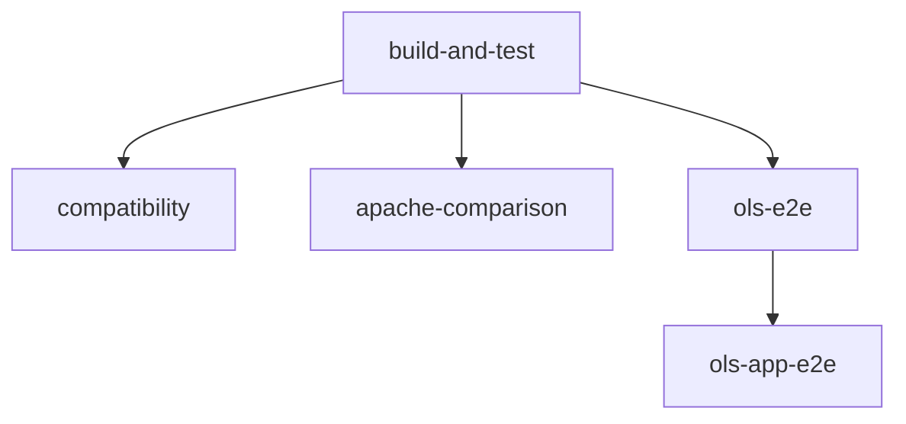
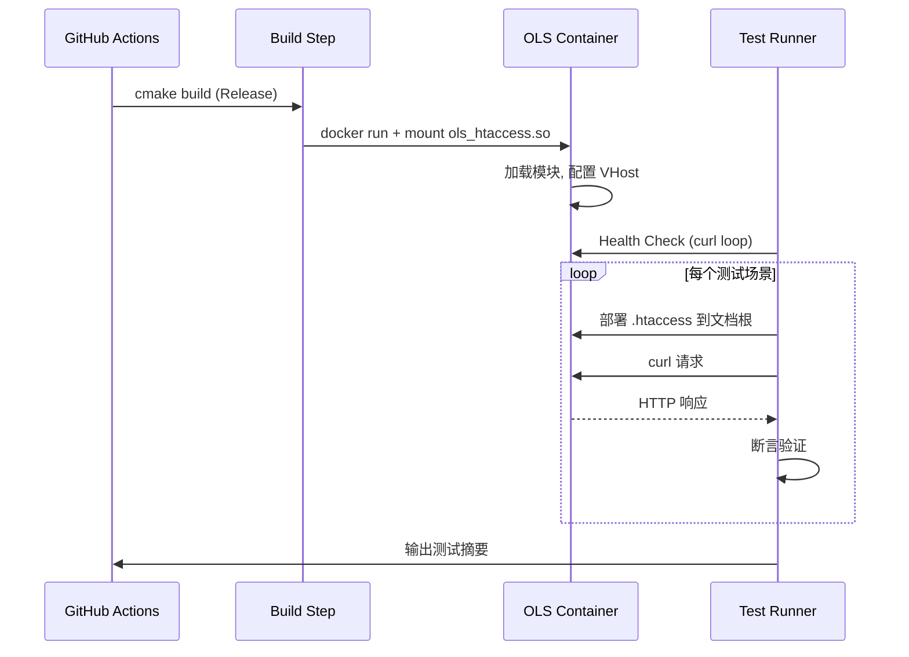
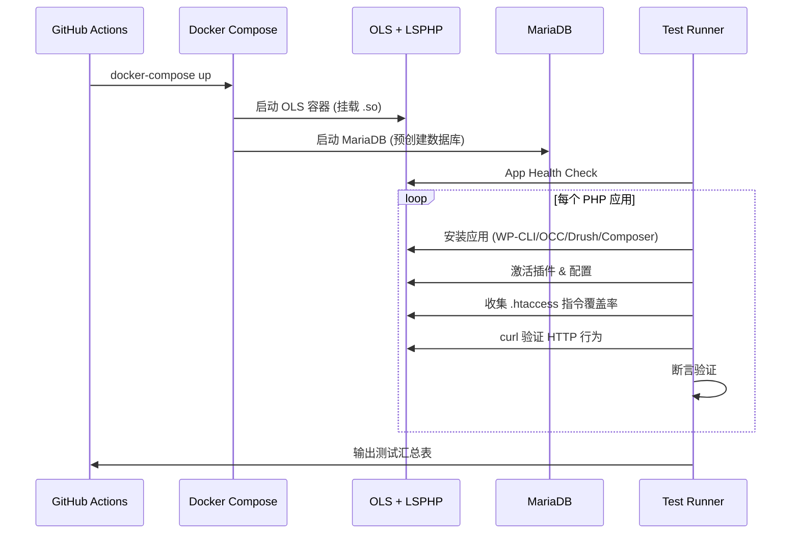

# 设计文档：OLS 端到端 CI 测试流水线

## 概述

本设计为 OLS .htaccess 模块构建两层端到端测试体系：

1. **指令级 E2E 测试**（`ols-e2e` job）：在单一 OLS Docker 容器中加载编译后的 `ols_htaccess.so`，通过 curl 断言验证 59 种指令类型在真实 OLS 环境中的 HTTP 行为。
2. **PHP 应用集成测试**（`ols-app-e2e` job）：通过 Docker Compose 搭建 OLS + LSPHP + MySQL 完整应用栈，自动安装 WordPress、Nextcloud、Drupal、Laravel，验证真实应用生成的 .htaccess 文件在模块处理下的正确行为。

两层测试均可通过本地脚本独立运行，也可作为 GitHub Actions CI 流水线的一部分自动执行。

### 设计决策

| 决策 | 选择 | 理由 |
|------|------|------|
| 测试脚本语言 | Bash + curl | 零依赖，CI runner 原生支持，与现有 Apache 对比测试风格一致 |
| OLS 镜像 | `litespeedtech/openlitespeed:latest` | 官方维护，预装 LSPHP，与生产环境一致 |
| 数据库 | MariaDB 10.11 | 轻量，WordPress/Nextcloud/Drupal 均支持 |
| 测试隔离 | 每个测试场景独立部署 .htaccess | 避免状态污染，失败可定位到具体指令 |
| PHP 应用安装 | WP-CLI / OCC CLI / Drush / Composer | 各应用官方推荐的自动化安装方式 |
| CI 拓扑 | 两个独立 job，串行依赖 | 指令测试快速反馈（~3min），应用测试允许较长超时（30min） |

## 架构

### CI 流水线拓扑



### 指令级 E2E 测试架构



### PHP 应用集成测试架构



## 组件与接口

### 1. Docker 基础设施

#### 1.1 OLS Dockerfile（指令测试用）

文件：`tests/e2e/Dockerfile`

基于 `litespeedtech/openlitespeed:latest`，执行以下配置：
- 复制编译好的 `ols_htaccess.so` 到 `/usr/local/lsws/modules/`
- 配置 `httpd_config.conf` 加载模块：`module ols_htaccess { ... }`
- 配置虚拟主机启用 `.htaccess` 解析（`configFile` 指向自定义 vhconf）
- 创建文档根目录 `/var/www/vhosts/test/` 并填充测试静态文件
- 暴露端口 8088

```dockerfile
FROM litespeedtech/openlitespeed:latest

# 复制模块
COPY build/ols_htaccess.so /usr/local/lsws/modules/ols_htaccess.so

# 复制 OLS 配置
COPY tests/e2e/conf/httpd_config.conf /usr/local/lsws/conf/httpd_config.conf
COPY tests/e2e/conf/vhconf.conf /usr/local/lsws/conf/vhosts/test/vhconf.conf

# 创建测试文档根
RUN mkdir -p /var/www/vhosts/test/html/subdir && \
    echo "<h1>OK</h1>" > /var/www/vhosts/test/html/index.html && \
    echo "img" > /var/www/vhosts/test/html/photo.jpg && \
    echo "custom" > /var/www/vhosts/test/html/subdir/custom.html && \
    chown -R nobody:nogroup /var/www/vhosts/test

EXPOSE 8088
```

#### 1.2 OLS 配置文件

`tests/e2e/conf/httpd_config.conf`：
- 加载 `ols_htaccess` 模块
- 定义 listener 绑定 `*:8088`
- 映射虚拟主机 `test`

`tests/e2e/conf/vhconf.conf`：
- `docRoot` 指向 `/var/www/vhosts/test/html`
- `enableRewrite 1`（启用 .htaccess 解析）
- `allowOverride 255`（等效 AllowOverride All）
- `autoIndex 0`（默认禁用目录列表，由 Options 指令控制）

#### 1.3 Docker Compose（PHP 应用测试用）

文件：`tests/e2e/docker-compose.yml`

```yaml
services:
  ols:
    build:
      context: ../..
      dockerfile: tests/e2e/Dockerfile.app
    ports:
      - "8088:8088"
    volumes:
      - app-data:/var/www/vhosts/apps/html
    depends_on:
      db:
        condition: service_healthy

  db:
    image: mariadb:10.11
    environment:
      MYSQL_ROOT_PASSWORD: rootpass
      MYSQL_DATABASE: wordpress
    volumes:
      - db-data:/var/lib/mysql
      - ./init-db.sql:/docker-entrypoint-initdb.d/init.sql
    healthcheck:
      test: ["CMD", "mariadb", "-uroot", "-prootpass", "-e", "SELECT 1"]
      interval: 5s
      timeout: 3s
      retries: 10

volumes:
  app-data:
  db-data:
```

`tests/e2e/init-db.sql`：
```sql
CREATE DATABASE IF NOT EXISTS nextcloud;
CREATE DATABASE IF NOT EXISTS drupal;
GRANT ALL ON wordpress.* TO 'appuser'@'%' IDENTIFIED BY 'apppass';
GRANT ALL ON nextcloud.* TO 'appuser'@'%';
GRANT ALL ON drupal.* TO 'appuser'@'%';
FLUSH PRIVILEGES;
```

### 2. E2E 测试框架

#### 2.1 断言辅助库

文件：`tests/e2e/lib/assertions.sh`

提供以下 Bash 函数：

```bash
# 核心断言
assert_status_code()     # 验证 HTTP 状态码
assert_header_exists()   # 验证响应头存在
assert_header_value()    # 验证响应头值
assert_header_absent()   # 验证响应头不存在
assert_body_contains()   # 验证响应体包含文本
assert_redirect()        # 验证重定向（状态码 + Location）

# 测试生命周期
deploy_htaccess()        # 部署 .htaccess 到容器文档根
cleanup_htaccess()       # 清理 .htaccess
run_test()               # 执行单个测试（名称 + 断言函数）
print_summary()          # 输出测试摘要（通过/失败/总数）
```

接口约定：
- `OLS_HOST`：OLS 容器地址（默认 `http://localhost:8088`）
- `OLS_DOCROOT`：容器内文档根路径
- `OLS_CONTAINER`：Docker 容器名称（用于 `docker cp` 部署 .htaccess）
- 每个断言失败时输出实际 HTTP 响应内容
- 全局计数器 `PASS_COUNT` / `FAIL_COUNT` 跟踪测试结果

#### 2.2 指令测试脚本

文件：`tests/e2e/test_directives.sh`

按指令类别组织测试函数：

```bash
test_header_set()           # Header set
test_header_always_set()    # Header always set
test_header_unset()         # Header unset
test_header_append()        # Header append
test_expires_by_type()      # ExpiresActive + ExpiresByType
test_expires_default()      # ExpiresDefault
test_redirect_301()         # Redirect 301
test_redirect_default()     # Redirect (默认 302)
test_error_document()       # ErrorDocument 404
test_acl_deny()             # Order + Deny from all
test_require_denied()       # Require all denied
test_require_granted()      # Require all granted
test_ifmodule()             # <IfModule>
test_ifmodule_negated()     # <IfModule !mod_nonexistent.c>
test_files_match()          # <FilesMatch>
test_files()                # <Files>
test_setenv()               # SetEnv
test_combined_wordpress()   # WordPress 风格组合
test_combined_security()    # 安全头组合
test_options_no_indexes()   # Options -Indexes
test_options_indexes()      # Options +Indexes
test_limit_post()           # <Limit POST>
test_limit_except_get()     # <LimitExcept GET>
test_directory_index()      # DirectoryIndex
```

#### 2.3 PHP 应用测试脚本

文件：`tests/e2e/test_apps.sh`

按应用组织测试函数：

```bash
# WordPress
install_wordpress()
test_wp_homepage()
test_wp_permalinks()
test_wp_admin()
test_wp_htaccess_parsed()

# WordPress 插件
install_wp_super_cache()
test_wp_super_cache_htaccess()
test_wp_super_cache_behavior()
install_w3_total_cache()
test_w3tc_htaccess()
test_w3tc_browser_cache()
install_wp_security()
test_wp_security_file_protection()
test_wp_security_directory_browsing()
test_wp_security_headers()

# Nextcloud
install_nextcloud()
test_nc_login_page()
test_nc_security_headers()
test_nc_no_indexes()
test_nc_htaccess_parsed()

# Drupal
install_drupal()
test_drupal_homepage()
test_drupal_files_match()
test_drupal_clean_urls()

# Laravel
install_laravel()
test_laravel_welcome()
test_laravel_routing()

# 覆盖率分析
collect_htaccess_coverage()
```

#### 2.4 指令覆盖率分析工具

文件：`tests/e2e/lib/coverage.sh`

```bash
# 从 .htaccess 文件提取指令类型
extract_directives()     # 解析 .htaccess 文件，输出指令名列表

# 与模块支持列表比对
check_coverage()         # 比对指令列表与 59 种支持类型

# 输出报告
print_coverage_report()  # 输出覆盖率统计（支持数/不支持数/百分比）
```

支持的 59 种指令名称映射表（硬编码在脚本中）：

```bash
SUPPORTED_DIRECTIVES=(
    "Header" "RequestHeader" "php_value" "php_flag"
    "php_admin_value" "php_admin_flag" "Order" "Allow"
    "Deny" "Redirect" "RedirectMatch" "ErrorDocument"
    "FilesMatch" "ExpiresActive" "ExpiresByType" "SetEnv"
    "SetEnvIf" "BrowserMatch" "BruteForceProtection"
    "IfModule" "Options" "Files" "ExpiresDefault"
    "Require" "RequireAny" "RequireAll" "Limit" "LimitExcept"
    "AuthType" "AuthName" "AuthUserFile" "AddHandler"
    "SetHandler" "AddType" "DirectoryIndex" "ForceType"
    "AddEncoding" "AddCharset"
)
```

### 3. 本地测试脚本

#### 3.1 `tests/e2e/run_directive_tests.sh`

```bash
#!/bin/bash
# 用法: ./run_directive_tests.sh [--keep]
# --keep: 测试完成后保留容器以便调试
```

流程：
1. `cmake -B build && cmake --build build` 编译模块
2. `docker build -t ols-e2e-test -f tests/e2e/Dockerfile .` 构建镜像
3. `docker run -d --name ols-e2e ...` 启动容器
4. 健康检查轮询（最多 60 秒）
5. 执行 `test_directives.sh`
6. 输出测试摘要
7. 若无 `--keep` 参数，清理容器

#### 3.2 `tests/e2e/run_app_tests.sh`

```bash
#!/bin/bash
# 用法: ./run_app_tests.sh [--wordpress|--nextcloud|--drupal|--laravel|--all] [--keep]
```

流程：
1. 编译模块
2. `docker-compose -f tests/e2e/docker-compose.yml up -d` 启动应用栈
3. 等待 MariaDB 和 OLS 健康检查通过
4. 根据参数选择运行对应应用测试
5. 输出测试汇总表
6. 若无 `--keep` 参数，`docker-compose down -v` 清理

### 4. CI 流水线集成

#### 4.1 `ols-e2e` Job

```yaml
ols-e2e:
  runs-on: ubuntu-latest
  needs: build-and-test
  steps:
    - uses: actions/checkout@v4
    - name: Install build deps
      run: sudo apt-get update && sudo apt-get install -y cmake g++ ninja-build
    - name: Build module
      run: |
        cmake -B build -G Ninja -DCMAKE_BUILD_TYPE=Release
        cmake --build build --parallel $(nproc)
    - name: Build OLS E2E image
      run: docker build -t ols-e2e-test -f tests/e2e/Dockerfile .
    - name: Start OLS container
      run: docker run -d --name ols-e2e -p 8088:8088 ols-e2e-test
    - name: Health check
      run: |
        for i in $(seq 1 60); do
          curl -sf http://localhost:8088/ && exit 0
          sleep 1
        done
        docker logs ols-e2e
        exit 1
    - name: Run directive E2E tests
      run: bash tests/e2e/test_directives.sh
    - name: Collect logs on failure
      if: failure()
      run: |
        docker exec ols-e2e cat /usr/local/lsws/logs/error.log || true
        docker exec ols-e2e cat /usr/local/lsws/logs/access.log || true
        docker exec ols-e2e ls /usr/local/lsws/modules/ || true
        docker logs ols-e2e || true
```

#### 4.2 `ols-app-e2e` Job

```yaml
ols-app-e2e:
  runs-on: ubuntu-latest
  needs: ols-e2e
  timeout-minutes: 30
  steps:
    - uses: actions/checkout@v4
    - name: Install build deps
      run: sudo apt-get update && sudo apt-get install -y cmake g++ ninja-build
    - name: Build module
      run: |
        cmake -B build -G Ninja -DCMAKE_BUILD_TYPE=Release
        cmake --build build --parallel $(nproc)
    - name: Start app stack
      run: docker-compose -f tests/e2e/docker-compose.yml up -d --build
    - name: Wait for services
      run: bash tests/e2e/lib/wait_for_services.sh
    - name: Run PHP app tests
      run: bash tests/e2e/test_apps.sh --all
    - name: Collect logs on failure
      if: failure()
      run: |
        docker-compose -f tests/e2e/docker-compose.yml logs ols || true
        docker-compose -f tests/e2e/docker-compose.yml exec ols cat /usr/local/lsws/logs/error.log || true
    - name: Cleanup
      if: always()
      run: docker-compose -f tests/e2e/docker-compose.yml down -v
```

## 数据模型

### 测试用例结构

每个指令级测试用例由以下数据组成：

```
TestCase {
    name: string              # 测试名称（如 "test_header_set"）
    htaccess_content: string  # .htaccess 文件内容
    request: {
        method: string        # HTTP 方法（GET/POST/HEAD）
        path: string          # 请求路径
        headers: map          # 可选请求头
    }
    assertions: [{
        type: enum            # status_code | header_exists | header_value |
                              # header_absent | body_contains | redirect
        expected: string      # 预期值
    }]
}
```

### PHP 应用测试夹具结构

```
AppTestFixture {
    app_name: string          # 应用名称（wordpress/nextcloud/drupal/laravel）
    install_fn: function      # 安装函数
    health_check: {
        url: string           # 健康检查 URL
        expected_status: int  # 预期状态码
        body_contains: string # 响应体包含文本
    }
    plugin_fixtures: [{
        plugin_name: string   # 插件名称
        install_cmd: string   # 安装命令
        config_steps: [string]# 配置步骤
        htaccess_checks: [{   # .htaccess 内容验证
            path: string      # .htaccess 文件路径
            contains: string  # 应包含的内容
        }]
        http_checks: [{       # HTTP 行为验证
            url: string
            method: string
            expected_status: int
            header_checks: map
        }]
    }]
}
```

### 指令覆盖率报告结构

```
CoverageReport {
    app_name: string
    htaccess_files: [{
        path: string
        directives: [string]
    }]
    summary: {
        total_directives: int
        supported: int
        unsupported: int
        coverage_pct: float
        unsupported_list: [string]
    }
}
```

### 文件目录结构

```
tests/e2e/
├── Dockerfile                    # 指令测试用 OLS 镜像
├── Dockerfile.app                # PHP 应用测试用 OLS 镜像（含 LSPHP）
├── docker-compose.yml            # PHP 应用栈定义
├── init-db.sql                   # MariaDB 初始化脚本
├── conf/
│   ├── httpd_config.conf         # OLS 主配置
│   └── vhconf.conf               # 虚拟主机配置
├── lib/
│   ├── assertions.sh             # 断言辅助函数库
│   ├── coverage.sh               # 指令覆盖率分析工具
│   └── wait_for_services.sh      # 服务健康检查等待脚本
├── test_directives.sh            # 指令级 E2E 测试主脚本
├── test_apps.sh                  # PHP 应用集成测试主脚本
├── run_directive_tests.sh        # 本地指令测试入口脚本
└── run_app_tests.sh              # 本地应用测试入口脚本
```


## 正确性属性

*正确性属性是在系统所有有效执行中都应成立的特征或行为——本质上是关于系统应该做什么的形式化陈述。属性是人类可读规范与机器可验证正确性保证之间的桥梁。*

以下属性基于需求文档中的验收标准推导而来。由于本功能主要是 E2E 集成测试（Bash + curl + Docker），属性测试将通过参数化的 Bash 测试函数实现，每个属性对应一组可变输入的测试循环。

### Property 1: Header 指令响应头正确性

*对于任意* Header 指令变体（set / always set / unset / append）和任意有效的 HTTP 头名称与值，将该指令部署为 .htaccess 后，OLS 的 HTTP 响应应正确反映该指令的效果：set/always set 应使响应包含该头，unset 应使响应不包含该头，append 应使响应头包含追加的值。

**Validates: Requirements 4.1, 4.2, 4.3, 4.4**

### Property 2: Expires 指令缓存控制正确性

*对于任意* 有效的 MIME 类型和过期时长，将 `ExpiresActive On` + `ExpiresByType` 或 `ExpiresDefault` 指令部署为 .htaccess 后，OLS 响应中的 `Cache-Control max-age` 值应等于指令指定的秒数。

**Validates: Requirements 4.5, 4.6**

### Property 3: Redirect 指令状态码与 Location 正确性

*对于任意* 有效的源路径和目标 URL，`Redirect 301` 应产生 301 状态码和正确的 `Location` 头；`Redirect`（无显式状态码）应默认产生 302 状态码。

**Validates: Requirements 5.1, 5.2**

### Property 4: 访问控制指令拒绝/允许正确性

*对于任意* 请求路径，当 .htaccess 包含拒绝访问指令（`Order Allow,Deny` + `Deny from all` 或 `Require all denied`）时，OLS 应返回 403；当包含 `Require all granted` 时，OLS 应返回 200。

**Validates: Requirements 5.4, 5.5, 5.6**

### Property 5: ErrorDocument 指令状态码正确性

*对于任意* 不存在的资源路径，当 .htaccess 包含 `ErrorDocument 404` 指令时，OLS 应返回 404 状态码。

**Validates: Requirements 5.3**

### Property 6: IfModule 容器条件执行正确性

*对于任意* IfModule 条件（正向引用已存在模块或否定引用不存在模块），当条件为真时，容器内的子指令应被正确执行并影响 HTTP 响应。

**Validates: Requirements 6.1, 6.2**

### Property 7: Files/FilesMatch 容器匹配正确性

*对于任意* 文件名和匹配模式，`<FilesMatch>` 容器内的指令应仅对匹配正则的文件生效，`<Files>` 容器内的指令应仅对精确匹配文件名的请求生效，不匹配的请求不受影响。

**Validates: Requirements 6.3, 6.4**

### Property 8: SetEnv 环境变量传递正确性

*对于任意* 有效的环境变量名和值，`SetEnv` 设置的变量应可在后续 `Header` 指令中通过 `%{VAR}e` 语法正确引用。

**Validates: Requirements 7.1**

### Property 9: Options Indexes 目录列表控制正确性

*对于任意* 不包含索引文件的目录，`Options -Indexes` 应使目录请求返回 403，`Options +Indexes` 应使目录请求返回 200 并包含目录列表内容。

**Validates: Requirements 8.1, 8.2**

### Property 10: Limit/LimitExcept HTTP 方法限制正确性

*对于任意* HTTP 方法，`<Limit POST>` + `Require all denied` 应使 POST 请求返回 403 而 GET 请求返回 200；`<LimitExcept GET>` + `Require all denied` 应使 GET 请求返回 200 而其他方法返回 403。

**Validates: Requirements 11.1, 11.2**

### Property 11: DirectoryIndex 默认文件正确性

*对于任意* 有效的文件名，当 `DirectoryIndex` 指定该文件且文件存在于目录中时，目录请求应返回该文件的内容。

**Validates: Requirements 12.1**

### Property 12: 健康检查轮询收敛性

*对于任意* 在 60 秒超时内成功启动的 OLS 容器，健康检查轮询应在容器就绪后检测到 HTTP 200 并成功返回；若超时则应以非零退出码终止。

**Validates: Requirements 3.1**

### Property 13: 测试摘要计数正确性

*对于任意* 通过和失败的测试组合，测试摘要输出的通过数和失败数之和应等于总测试数，且各计数应与实际执行结果一致。

**Validates: Requirements 9.3**

### Property 14: 指令覆盖率分析正确性

*对于任意* .htaccess 文件集合，覆盖率工具应正确提取所有指令类型，与模块支持的 59 种指令比对后输出准确的支持数、不支持数和覆盖率百分比；不支持的指令应标记为 WARNING。

**Validates: Requirements 20.1, 20.2, 20.3, 20.4**

### Property 15: 插件激活后应用核心功能稳定性

*对于任意* WordPress 插件激活或配置变更操作，操作完成后应用的核心功能（首页可访问、管理后台可访问）应保持正常。

**Validates: Requirements 21.4**

### Property 16: 本地测试脚本参数路由正确性

*对于任意* 有效的应用参数（`--wordpress`、`--nextcloud`、`--drupal`、`--laravel`、`--all`），`run_app_tests.sh` 应仅执行对应应用的测试函数。

**Validates: Requirements 22.2**

## 错误处理

### Docker 环境错误

| 错误场景 | 处理策略 |
|----------|----------|
| OLS 容器启动失败 | 输出 `docker logs`，以非零退出码终止 CI |
| 模块加载失败 | 健康检查通过但指令不生效，测试断言失败后收集 error.log |
| 端口冲突 | 使用固定端口 8088，CI runner 上无冲突风险 |
| Docker 镜像拉取失败 | GitHub Actions 自动重试，超时后 CI 失败 |

### 测试执行错误

| 错误场景 | 处理策略 |
|----------|----------|
| curl 超时 | 设置 `--max-time 10`，超时视为测试失败 |
| .htaccess 部署失败 | `docker cp` 失败时立即终止当前测试，记录错误 |
| 断言失败 | 输出实际 HTTP 响应（状态码 + 头 + 体），继续执行后续测试 |
| OLS 进程崩溃 | 后续所有测试失败，failure step 收集 core dump 和日志 |

### PHP 应用错误

| 错误场景 | 处理策略 |
|----------|----------|
| 数据库连接失败 | MariaDB healthcheck 确保就绪，超时后输出数据库日志 |
| WP-CLI/OCC/Drush 安装失败 | 输出安装命令的 stderr，标记该应用测试为 SKIP |
| 插件安装失败 | 输出 WP-CLI 错误信息，跳过该插件的后续测试 |
| PHP Fatal Error | 收集 PHP error log，标记测试失败 |
| 应用健康检查失败 | 输出 OLS access.log + error.log + PHP error log |

### 日志收集策略

CI `failure()` 步骤收集以下日志：
- `/usr/local/lsws/logs/error.log` — OLS 错误日志
- `/usr/local/lsws/logs/access.log` — OLS 访问日志
- `/usr/local/lsws/modules/` 目录列表 — 确认模块加载
- `docker logs <container>` — 容器标准输出/错误
- PHP error log（应用测试时）
- 各应用自身日志（WordPress debug.log 等）

## 测试策略

### 双重测试方法

本功能采用 E2E 集成测试（Bash + curl）和属性化参数测试相结合的策略：

#### 单元测试（示例测试）

针对具体场景的固定输入测试：
- 每个指令类型至少一个具体测试用例（如 `Header set X-Test "value"`）
- WordPress/Nextcloud/Drupal/Laravel 各应用的安装和功能验证
- 插件激活后的具体 .htaccess 规则验证
- CI 配置的静态检查（job 名称、依赖关系、超时设置）

#### 属性测试（参数化测试）

通过参数化循环验证通用属性：
- Header 指令：遍历多组头名称/值组合验证
- Expires 指令：遍历多种 MIME 类型和时长验证
- 访问控制：遍历多种 deny/grant 指令组合验证
- Limit/LimitExcept：遍历多种 HTTP 方法验证
- 覆盖率工具：使用多个不同的 .htaccess 样本验证

#### 属性测试库选择

由于 E2E 测试使用 Bash 脚本，不使用传统 PBT 库。取而代之，通过以下方式实现属性验证：
- 参数化 Bash 函数，接受指令参数并验证 HTTP 行为
- 循环遍历预定义的输入集合（至少 100 组输入用于关键属性）
- 每个参数化测试函数注释引用设计文档属性编号

#### 测试标签格式

每个测试函数应包含注释标签：
```bash
# Feature: ols-e2e-ci, Property 1: Header 指令响应头正确性
test_header_set() { ... }
```

### 测试覆盖矩阵

| 指令类别 | 指令数量 | E2E 测试数 | 属性覆盖 |
|----------|----------|-----------|----------|
| Header (set/unset/append/merge/add) | 5 | 4 | Property 1 |
| Header always (set/unset/append/merge/add) | 5 | 2 | Property 1 |
| Expires (Active/ByType/Default) | 3 | 2 | Property 2 |
| Redirect / RedirectMatch | 2 | 2 | Property 3 |
| Access Control (Order/Allow/Deny) | 3 | 1 | Property 4 |
| Require (granted/denied/ip) | 5 | 2 | Property 4 |
| ErrorDocument | 1 | 1 | Property 5 |
| IfModule | 1 | 2 | Property 6 |
| Files / FilesMatch | 2 | 2 | Property 7 |
| SetEnv / SetEnvIf / BrowserMatch | 3 | 1 | Property 8 |
| Options | 1 | 2 | Property 9 |
| Limit / LimitExcept | 2 | 2 | Property 10 |
| DirectoryIndex | 1 | 1 | Property 11 |
| PHP/Auth/Handler/其他 | 25 | 通过应用测试间接覆盖 | — |

### PHP 应用测试矩阵

| 应用 | 安装方式 | 插件测试 | 覆盖率分析 |
|------|----------|----------|-----------|
| WordPress | WP-CLI | WP Super Cache, W3 Total Cache, AIOS | ✓ |
| Nextcloud | OCC CLI | — (内置 .htaccess) | ✓ |
| Drupal | Drush/Composer | — (内置 .htaccess) | ✓ |
| Laravel | Composer | — (内置 .htaccess) | ✓ |
