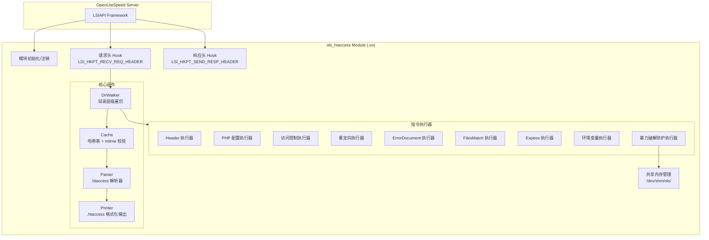
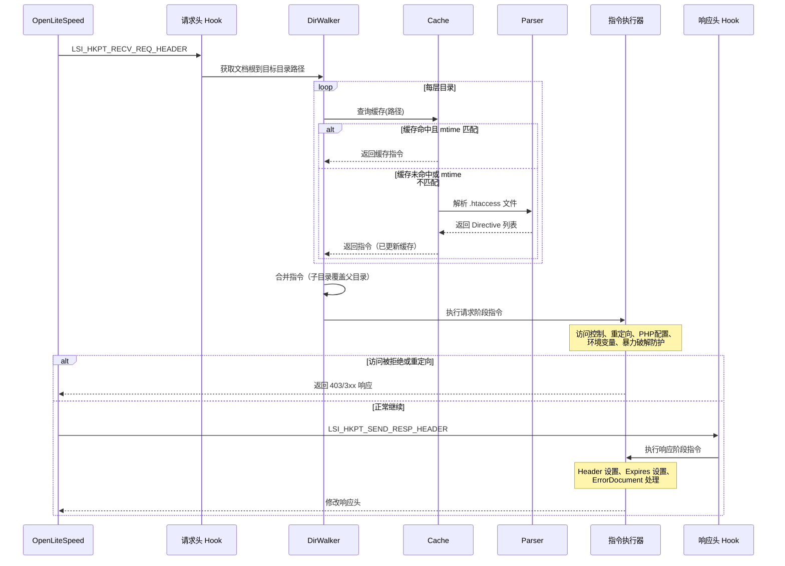

# 设计文档：OLS .htaccess 模块

## 概述

本模块是一个 OpenLiteSpeed LSIAPI 原生模块（编译为 .so 共享库），用于在 OLS 请求处理管线中解析和执行 Apache .htaccess 文件指令。模块通过 LSIAPI Hook 机制介入请求处理流程，在 `LSI_HKPT_RECV_REQ_HEADER` 阶段处理访问控制、重定向、PHP 配置、环境变量等指令，在 `LSI_HKPT_SEND_RESP_HEADER` 阶段处理响应头修改和缓存过期指令。

核心设计目标：
- 兼容常用 Apache .htaccess 指令，降低 Apache → OLS 迁移成本
- 高性能：缓存命中时每请求额外开销 < 0.5ms，每缓存条目 ≤ 2KB
- 可靠性：解析器支持 round-trip 属性，确保解析/打印的正确性
- 安全性：暴力破解防护使用共享内存（/dev/shm/ols/）进行跨进程 IP 追踪

## 架构

### 整体架构



### 请求处理流程



### Hook 阶段划分

| Hook 阶段 | 处理的指令类型 | 优先级 |
|---|---|---|
| `LSI_HKPT_RECV_REQ_HEADER` | 访问控制 (Order/Allow/Deny)、重定向 (Redirect/RedirectMatch)、PHP 配置 (php_value/php_flag)、环境变量 (SetEnv/SetEnvIf/BrowserMatch)、暴力破解防护 (BruteForce*) | 高（需在请求处理早期决定） |
| `LSI_HKPT_SEND_RESP_HEADER` | Header/RequestHeader 指令、Expires 指令、ErrorDocument 指令 | 中（需在响应生成后修改） |


## 组件与接口

### 1. 模块入口 (`mod_htaccess.c`)

LSIAPI 模块注册入口，负责生命周期管理。

```c
// 模块描述符
lsi_module_t MNAME = {
    LSI_MODULE_SIGNATURE,
    mod_htaccess_init,      // 模块初始化
    mod_htaccess_handler,   // 请求处理（未使用，用 NULL）
    NULL,                   // config_parser
    "ols-htaccess",         // module name
    NULL,                   // server hooks (通过 init 注册)
    NULL                    // module data
};

// 初始化函数
int mod_htaccess_init(lsi_module_t *module);

// Hook 回调
int on_recv_req_header(lsi_session_t *session);
int on_send_resp_header(lsi_session_t *session);

// 清理函数
int mod_htaccess_cleanup(lsi_module_t *module);
```

### 2. Parser (`htaccess_parser.h`)

将 .htaccess 文件文本解析为结构化的 Directive 对象列表。

```c
// 解析 .htaccess 文件内容
// 返回: 成功返回 Directive 链表头指针，失败返回 NULL
// 参数 filepath 仅用于错误日志中标识文件
htaccess_directive_t *htaccess_parse(const char *content, size_t len,
                                      const char *filepath);

// 释放 Directive 链表
void htaccess_directives_free(htaccess_directive_t *head);
```

### 3. Printer (`htaccess_printer.h`)

将 Directive 对象列表格式化输出为 .htaccess 文本。

```c
// 将 Directive 链表格式化为 .htaccess 文本
// 返回: 动态分配的字符串，调用者负责释放
// 返回 NULL 表示失败
char *htaccess_print(const htaccess_directive_t *head);
```

### 4. Cache (`htaccess_cache.h`)

基于哈希表的缓存，以文件绝对路径为键，支持 mtime 失效。

```c
// 初始化缓存（在模块 init 时调用）
int htaccess_cache_init(size_t initial_buckets);

// 查询缓存，如果命中且 mtime 匹配则返回缓存的指令
// 如果未命中或 mtime 不匹配，返回 NULL
// out_directives: 输出参数，指向缓存的 Directive 链表（不可释放）
int htaccess_cache_get(const char *filepath, time_t current_mtime,
                       htaccess_directive_t **out_directives);

// 将解析结果存入缓存
int htaccess_cache_put(const char *filepath, time_t mtime,
                       htaccess_directive_t *directives);

// 销毁缓存（在模块 cleanup 时调用）
void htaccess_cache_destroy(void);
```

### 5. DirWalker (`htaccess_dirwalker.h`)

从文档根目录遍历到目标目录，收集并合并各层 .htaccess 指令。

```c
// 收集从 doc_root 到 target_dir 路径上所有 .htaccess 指令
// 返回合并后的 Directive 链表（子目录覆盖父目录同类指令）
htaccess_directive_t *htaccess_dirwalk(lsi_session_t *session,
                                        const char *doc_root,
                                        const char *target_dir);
```

### 6. 指令执行器 (`htaccess_exec_*.h`)

每种指令类型对应一个执行器函数：

```c
// Header 指令执行器
int exec_header(lsi_session_t *session, const htaccess_directive_t *dir);
int exec_request_header(lsi_session_t *session, const htaccess_directive_t *dir);

// PHP 配置执行器
int exec_php_value(lsi_session_t *session, const htaccess_directive_t *dir);
int exec_php_flag(lsi_session_t *session, const htaccess_directive_t *dir);
int exec_php_admin_value(lsi_session_t *session, const htaccess_directive_t *dir);
int exec_php_admin_flag(lsi_session_t *session, const htaccess_directive_t *dir);

// 访问控制执行器
int exec_access_control(lsi_session_t *session,
                        const htaccess_directive_t *directives);

// 重定向执行器
int exec_redirect(lsi_session_t *session, const htaccess_directive_t *dir);
int exec_redirect_match(lsi_session_t *session, const htaccess_directive_t *dir);

// ErrorDocument 执行器
int exec_error_document(lsi_session_t *session, const htaccess_directive_t *dir);

// FilesMatch 执行器
int exec_files_match(lsi_session_t *session, const htaccess_directive_t *dir,
                     const char *filename);

// Expires 执行器
int exec_expires(lsi_session_t *session, const htaccess_directive_t *dir,
                 const char *content_type);

// 环境变量执行器
int exec_setenv(lsi_session_t *session, const htaccess_directive_t *dir);
int exec_setenvif(lsi_session_t *session, const htaccess_directive_t *dir);
int exec_browser_match(lsi_session_t *session, const htaccess_directive_t *dir);

// 暴力破解防护执行器
int exec_brute_force(lsi_session_t *session,
                     const htaccess_directive_t *directives,
                     const char *client_ip);
```

### 7. 共享内存管理 (`htaccess_shm.h`)

暴力破解防护的 IP 追踪数据存储在共享内存中。

```c
// IP 追踪记录
typedef struct {
    char ip[46];           // IPv4 或 IPv6 地址字符串
    int attempt_count;     // 失败尝试次数
    time_t first_attempt;  // 窗口内首次尝试时间
    time_t blocked_until;  // 封锁截止时间（0 表示未封锁）
} brute_force_record_t;

// 初始化共享内存区域
int shm_init(const char *shm_path, size_t max_records);

// 查询/更新 IP 记录
brute_force_record_t *shm_get_record(const char *ip);
int shm_update_record(const char *ip, const brute_force_record_t *record);

// 清理过期记录
int shm_cleanup_expired(time_t now);

// 销毁共享内存
void shm_destroy(void);
```


## 数据模型

### Directive 结构体

```c
// 指令类型枚举
typedef enum {
    DIR_HEADER_SET,
    DIR_HEADER_UNSET,
    DIR_HEADER_APPEND,
    DIR_HEADER_MERGE,
    DIR_HEADER_ADD,
    DIR_REQUEST_HEADER_SET,
    DIR_REQUEST_HEADER_UNSET,
    DIR_PHP_VALUE,
    DIR_PHP_FLAG,
    DIR_PHP_ADMIN_VALUE,
    DIR_PHP_ADMIN_FLAG,
    DIR_ORDER,
    DIR_ALLOW_FROM,
    DIR_DENY_FROM,
    DIR_REDIRECT,
    DIR_REDIRECT_MATCH,
    DIR_ERROR_DOCUMENT,
    DIR_FILES_MATCH,          // 容器指令，包含子指令
    DIR_EXPIRES_ACTIVE,
    DIR_EXPIRES_BY_TYPE,
    DIR_SETENV,
    DIR_SETENVIF,
    DIR_BROWSER_MATCH,
    DIR_BRUTE_FORCE_PROTECTION,
    DIR_BRUTE_FORCE_ALLOWED_ATTEMPTS,
    DIR_BRUTE_FORCE_WINDOW,
    DIR_BRUTE_FORCE_ACTION,
    DIR_BRUTE_FORCE_THROTTLE_DURATION,
} directive_type_t;

// 访问控制顺序
typedef enum {
    ORDER_ALLOW_DENY,   // 默认拒绝，先 Allow 后 Deny
    ORDER_DENY_ALLOW,   // 默认允许，先 Deny 后 Allow
} acl_order_t;

// 暴力破解防护动作
typedef enum {
    BF_ACTION_BLOCK,
    BF_ACTION_THROTTLE,
} bf_action_t;

// 指令结构体（链表节点）
typedef struct htaccess_directive {
    directive_type_t type;
    int line_number;              // 源文件行号（用于日志）

    // 通用键值对（大多数指令使用）
    char *name;                   // 指令名/头名/变量名/MIME类型
    char *value;                  // 指令值/头值/变量值

    // 特定指令字段
    union {
        struct {
            acl_order_t order;
        } acl;
        struct {
            int status_code;      // HTTP 状态码 (301, 302, 等)
            char *pattern;        // RedirectMatch 的正则模式
        } redirect;
        struct {
            int error_code;       // HTTP 错误码 (403, 404, 500, 等)
        } error_doc;
        struct {
            char *pattern;        // FilesMatch 正则模式
            struct htaccess_directive *children; // 嵌套指令链表
        } files_match;
        struct {
            int active;           // 1=On, 0=Off
            long duration_sec;    // 过期时长（秒）
        } expires;
        struct {
            char *attribute;      // SetEnvIf 匹配的属性名
            char *pattern;        // SetEnvIf 正则模式
        } envif;
        struct {
            int enabled;          // BruteForceProtection On/Off
            int allowed_attempts; // 允许的尝试次数
            int window_sec;       // 时间窗口（秒）
            bf_action_t action;   // block 或 throttle
            int throttle_ms;      // throttle 延迟（毫秒）
        } brute_force;
    } data;

    struct htaccess_directive *next; // 链表下一节点
} htaccess_directive_t;
```

### 缓存条目结构体

```c
typedef struct {
    char *filepath;                // .htaccess 文件绝对路径（哈希键）
    time_t mtime;                  // 文件修改时间
    htaccess_directive_t *directives; // 解析后的指令链表
    size_t memory_usage;           // 本条目内存占用（字节）
} cache_entry_t;

// 哈希表结构
typedef struct {
    cache_entry_t **buckets;       // 桶数组
    size_t num_buckets;            // 桶数量
    size_t num_entries;            // 当前条目数
} htaccess_cache_t;
```

### CIDR 匹配结构体

```c
typedef struct {
    uint32_t network;    // 网络地址（主机字节序）
    uint32_t mask;       // 子网掩码
} cidr_v4_t;

// 解析 CIDR 字符串为结构体
int cidr_parse(const char *cidr_str, cidr_v4_t *out);

// 检查 IP 是否在 CIDR 范围内
int cidr_match(const cidr_v4_t *cidr, uint32_t ip);
```

### Expires 时长解析

```c
// 解析 "access plus N unit" 格式的过期时长
// 返回秒数，失败返回 -1
long parse_expires_duration(const char *duration_str);
```

### 设计决策说明

1. **链表 vs 数组存储指令**：选择链表是因为 .htaccess 文件中指令数量不确定，链表便于动态增长和合并（目录继承时拼接链表为 O(1)）。缓存命中后遍历链表的开销在典型场景（< 50 条指令）下可忽略。

2. **union 存储特定字段**：使用 union 减少每个 Directive 节点的内存占用，因为不同类型的指令使用不同的字段集合，互不重叠。

3. **共享内存用于暴力破解防护**：OLS 使用多进程模型，暴力破解防护需要跨进程共享 IP 追踪数据。使用 `/dev/shm/ols/` 下的共享内存文件配合文件锁实现进程间同步。

4. **mtime 缓存失效策略**：使用文件修改时间作为缓存失效依据，避免了 inotify 的复杂性。stat() 系统调用开销极小（< 1μs），适合高频请求场景。

5. **两阶段 Hook 处理**：将指令分为请求阶段和响应阶段执行，是因为访问控制和重定向需要在请求处理早期决定（可能终止请求），而 Header 修改和 Expires 设置需要在响应生成后才能应用。


## 正确性属性

*属性（Property）是指在系统所有有效执行中都应成立的特征或行为——本质上是关于系统应该做什么的形式化陈述。属性是人类可读规范与机器可验证正确性保证之间的桥梁。*

### Property 1: .htaccess 解析/打印 Round-Trip

*对于任意*有效的 .htaccess 文件内容，先解析（parse）再打印（print）再解析（parse），所得到的 Directive 对象列表应与第一次解析的结果等价（类型、顺序、键值均相同）。

**Validates: Requirements 2.5, 2.6**

### Property 2: 解析保序性

*对于任意*包含 N 条有效指令的 .htaccess 文件内容，解析后应产生恰好 N 个 Directive 对象，且顺序与源文件中的出现顺序一致。这包括 FilesMatch 块内的嵌套指令。

**Validates: Requirements 2.2, 9.3**

### Property 3: 缓存 Round-Trip

*对于任意*文件路径和 Directive 列表，执行 cache_put(path, mtime, directives) 后，cache_get(path, mtime) 应返回与原始 directives 等价的数据。

**Validates: Requirements 3.1, 3.2, 3.3**

### Property 4: 缓存 mtime 失效

*对于任意*已缓存的条目（path, mtime1），当以不同的 mtime2（mtime2 ≠ mtime1）调用 cache_get(path, mtime2) 时，应返回缓存未命中（NULL），触发重新解析。

**Validates: Requirements 3.4**

### Property 5: Header set 替换语义

*对于任意*响应头名称和值，执行 Header set 指令后，响应中该头名称应恰好有一个值，且等于指定的值（替换任何已有值）。

**Validates: Requirements 4.1**

### Property 6: Header unset 移除语义

*对于任意*响应中已存在的头名称，执行 Header unset 指令后，响应中不应再包含该头名称。

**Validates: Requirements 4.2**

### Property 7: Header append 追加语义

*对于任意*已有响应头值 V1 和追加值 V2，执行 Header append 后，该头的值应包含 V1 和 V2，以逗号分隔。

**Validates: Requirements 4.3**

### Property 8: Header merge 幂等性

*对于任意*响应头和值 V，连续执行两次 Header merge V，结果应与执行一次相同（值 V 在头中只出现一次）。

**Validates: Requirements 4.4**

### Property 9: Header add 累加语义

*对于任意*头名称和值，执行 Header add 后，该名称的响应头数量应比执行前多 1。

**Validates: Requirements 4.5**

### Property 10: RequestHeader set/unset 语义

*对于任意*请求头名称和值，执行 RequestHeader set 后该请求头应被设置为指定值；执行 RequestHeader unset 后该请求头应被移除。

**Validates: Requirements 4.6, 4.7**

### Property 11: PHP admin 级别设置不可覆盖

*对于任意* PHP 设置名称，若父目录 .htaccess 中存在 php_admin_value/php_admin_flag 指令，则子目录中同名的 php_value/php_flag 指令在目录合并后不应覆盖父目录的 admin 级别设置。

**Validates: Requirements 5.3, 5.4**

### Property 12: ACL 评估正确性

*对于任意* Order 类型（Allow,Deny 或 Deny,Allow）、任意 Allow/Deny 规则集合（含 CIDR 范围）和任意客户端 IP 地址，访问控制评估结果应符合 Apache ACL 语义：Order Allow,Deny 默认拒绝后先评估 Allow 再评估 Deny；Order Deny,Allow 默认允许后先评估 Deny 再评估 Allow。被拒绝的 IP 应收到 403 响应。

**Validates: Requirements 6.1, 6.2, 6.3, 6.4, 6.6**

### Property 13: CIDR 匹配正确性

*对于任意*有效的 CIDR 范围和 IP 地址，cidr_match 应返回 true 当且仅当该 IP 在 CIDR 范围内（即 IP & mask == network & mask）。

**Validates: Requirements 6.3, 6.4**

### Property 14: Redirect 响应正确性

*对于任意* HTTP 状态码和目标 URL，执行 Redirect 指令后，响应状态码应等于指定值，Location 头应等于目标 URL。

**Validates: Requirements 7.1**

### Property 15: RedirectMatch 捕获组替换

*对于任意*包含捕获组的正则表达式、匹配的请求 URI 和包含 $N 反向引用的目标 URL 模板，执行 RedirectMatch 后，Location 头中的 $N 应被替换为对应的捕获值。

**Validates: Requirements 7.3, 7.4**

### Property 16: Redirect 短路执行

*对于任意*指令列表，若其中某条 Redirect/RedirectMatch 指令匹配了请求，则该指令之后的所有指令不应被执行。

**Validates: Requirements 7.5**

### Property 17: ErrorDocument 外部 URL 重定向

*对于任意* HTTP 错误码和外部 URL，ErrorDocument 指令应产生 302 重定向到该 URL。

**Validates: Requirements 8.2**

### Property 18: ErrorDocument 文本消息

*对于任意* HTTP 错误码和带引号的文本消息，ErrorDocument 指令应将该文本作为响应体返回。

**Validates: Requirements 8.3**

### Property 19: FilesMatch 条件应用

*对于任意*正则表达式模式和文件名，FilesMatch 块内的指令应当且仅当文件名匹配该正则时被应用。

**Validates: Requirements 9.1, 9.2**

### Property 20: Expires 时长解析

*对于任意*有效的过期时长格式字符串（"access plus N seconds/minutes/hours/days/months/years"），parse_expires_duration 应返回正确的秒数值。

**Validates: Requirements 10.4**

### Property 21: ExpiresByType 头设置

*对于任意* MIME 类型和过期时长（在 ExpiresActive On 的前提下），执行 ExpiresByType 后，响应应包含正确的 Expires 头和 Cache-Control: max-age=N 头。

**Validates: Requirements 10.3**

### Property 22: SetEnvIf 条件设置

*对于任意*请求属性值、正则模式和环境变量名，SetEnvIf/BrowserMatch 应设置环境变量当且仅当属性值匹配正则模式。

**Validates: Requirements 11.2, 11.6**

### Property 23: 暴力破解防护触发

*对于任意*客户端 IP、允许尝试次数 N 和时间窗口 W，在窗口 W 内第 N+1 次失败尝试后，该 IP 应被标记为受保护状态（block 时返回 403）。窗口外的尝试不应计入。

**Validates: Requirements 12.2, 12.3, 12.4, 12.5**

### Property 24: 目录层级继承

*对于任意*目录层级结构（从文档根到目标目录），合并后的指令应满足：(a) 子目录同类指令覆盖父目录指令；(b) 无 .htaccess 文件的目录不影响继承链；(c) 处理顺序为从根到目标目录。

**Validates: Requirements 13.1, 13.2, 13.3**


## 错误处理

### 解析错误

| 错误场景 | 处理方式 | 日志级别 |
|---|---|---|
| .htaccess 文件不存在 | 跳过该目录，继续处理 | DEBUG |
| .htaccess 文件无读取权限 | 跳过该文件，记录警告 | WARN |
| 单行指令语法错误 | 跳过该行，继续解析后续行 | WARN（含文件路径和行号） |
| 未闭合的 FilesMatch 块 | 跳过整个块，记录警告 | WARN |
| 无效的正则表达式 | 跳过包含该正则的指令 | WARN |

### 执行错误

| 错误场景 | 处理方式 | 日志级别 |
|---|---|---|
| CIDR 格式无效 | 跳过该 Allow/Deny 规则 | WARN |
| ErrorDocument 指定的本地文件不存在 | 回退到 OLS 默认错误页 | WARN |
| PHP_INI_SYSTEM 级别设置被 php_value 引用 | 忽略该指令 | WARN |
| Redirect 目标 URL 格式无效 | 跳过该重定向指令 | WARN |
| 共享内存分配失败 | 禁用暴力破解防护，继续处理请求 | ERROR |
| 缓存内存分配失败 | 不缓存，每次重新解析 | WARN |

### 错误处理原则

1. **优雅降级**：任何单条指令的错误不应影响其他指令的执行或导致请求处理中断
2. **安全默认**：访问控制相关错误时，倾向于拒绝访问（安全优先）
3. **详细日志**：所有错误均记录文件路径、行号和具体原因，便于管理员排查
4. **不崩溃**：模块内部错误不应导致 OLS 进程崩溃，所有内存操作需检查返回值

## 测试策略

### 测试框架选择

- **单元测试框架**：[Google Test (gtest)](https://github.com/google/googletest) — C/C++ 项目的标准单元测试框架
- **属性测试框架**：[RapidCheck](https://github.com/emil-e/rapidcheck) — C++ 属性测试库，与 Google Test 集成良好，支持自定义生成器

### 双重测试方法

本项目采用单元测试与属性测试互补的策略：

**单元测试**负责：
- 特定示例的正确性验证（如解析已知的 .htaccess 文件片段）
- 边界条件和错误处理（如空文件、语法错误、文件不存在）
- 集成点验证（如 LSIAPI Hook 注册、PHP 配置传递）
- 默认值验证（如 BruteForce 默认 10 次尝试、302 默认重定向）

**属性测试**负责：
- 验证设计文档中定义的 24 条正确性属性
- 通过随机生成大量输入覆盖边界情况
- 每条属性测试至少运行 100 次迭代

### 属性测试配置

- 每条属性测试必须引用设计文档中的属性编号
- 标签格式：`Feature: ols-htaccess-module, Property {N}: {property_text}`
- 每条正确性属性由一个属性测试实现
- 最低迭代次数：100 次

### 自定义生成器

属性测试需要以下自定义 RapidCheck 生成器：

1. **Directive 生成器**：生成随机但有效的 Directive 对象（覆盖所有 directive_type_t 枚举值）
2. **.htaccess 内容生成器**：生成包含随机有效指令的 .htaccess 文件文本
3. **CIDR 生成器**：生成随机有效的 CIDR 范围和对应的 IP 地址（含范围内和范围外）
4. **HTTP Header 生成器**：生成随机的头名称和值（含特殊字符）
5. **目录层级生成器**：生成随机深度的目录结构和对应的 .htaccess 文件集合
6. **Expires 时长字符串生成器**：生成 "access plus N unit" 格式的随机有效字符串
7. **正则表达式生成器**：生成简单的随机正则表达式（用于 RedirectMatch、FilesMatch、SetEnvIf）

### 测试分层

```
tests/
├── unit/                          # 单元测试
│   ├── test_parser.cpp            # 解析器示例测试
│   ├── test_cache.cpp             # 缓存示例测试
│   ├── test_exec_header.cpp       # Header 执行器测试
│   ├── test_exec_acl.cpp          # 访问控制测试
│   ├── test_exec_redirect.cpp     # 重定向测试
│   ├── test_exec_brute_force.cpp  # 暴力破解防护测试
│   ├── test_cidr.cpp              # CIDR 解析/匹配测试
│   ├── test_expires_parse.cpp     # Expires 时长解析测试
│   └── test_dirwalker.cpp         # 目录遍历测试
├── property/                      # 属性测试
│   ├── prop_parser_roundtrip.cpp  # Property 1: 解析/打印 round-trip
│   ├── prop_parser_order.cpp      # Property 2: 解析保序性
│   ├── prop_cache.cpp             # Property 3-4: 缓存 round-trip 和失效
│   ├── prop_header.cpp            # Property 5-10: Header 指令语义
│   ├── prop_php_admin.cpp         # Property 11: PHP admin 不可覆盖
│   ├── prop_acl.cpp               # Property 12-13: ACL 评估和 CIDR 匹配
│   ├── prop_redirect.cpp          # Property 14-16: 重定向语义
│   ├── prop_error_document.cpp    # Property 17-18: ErrorDocument 语义
│   ├── prop_files_match.cpp       # Property 19: FilesMatch 条件应用
│   ├── prop_expires.cpp           # Property 20-21: Expires 解析和头设置
│   ├── prop_env.cpp               # Property 22: SetEnvIf 条件设置
│   ├── prop_brute_force.cpp       # Property 23: 暴力破解防护触发
│   └── prop_dir_inherit.cpp       # Property 24: 目录层级继承
└── generators/                    # 自定义 RapidCheck 生成器
    ├── gen_directive.h             # Directive 生成器
    ├── gen_htaccess.h              # .htaccess 内容生成器
    ├── gen_cidr.h                  # CIDR 生成器
    ├── gen_header.h                # HTTP Header 生成器
    ├── gen_directory.h             # 目录层级生成器
    ├── gen_expires.h               # Expires 时长生成器
    └── gen_regex.h                 # 正则表达式生成器
```

### LSIAPI Mock 层

由于属性测试和单元测试无法依赖运行中的 OLS 实例，需要提供 LSIAPI 的 Mock 实现：

```c
// mock_lsiapi.h - 模拟 LSIAPI 接口
// 提供 lsi_session_t 的模拟实现，支持：
// - 设置/获取请求头和响应头
// - 设置/获取环境变量
// - 设置响应状态码
// - 记录 PHP 配置调用
// 所有操作记录在内存中，供测试断言使用
```

